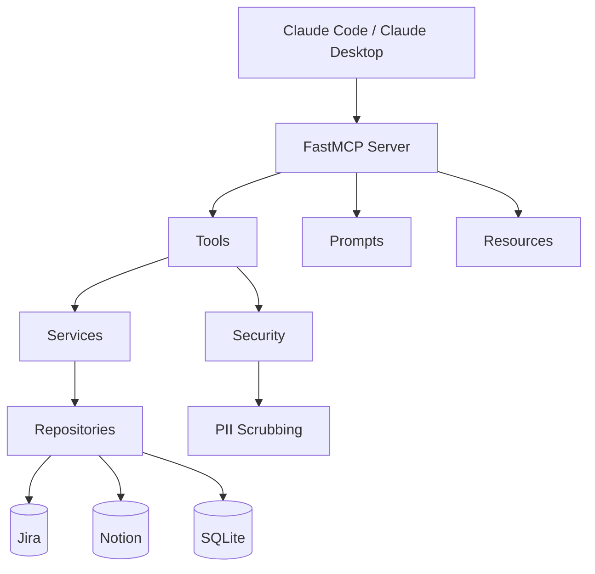

# Wizard

[](https://www.python.org/downloads/)
[](LICENSE)
[](https://github.com/jlowin/fastmcp)
[](https://www.sqlite.org/)

*A local memory layer for AI agents. Syncs Jira and Notion, scrubs PII, and surfaces structured context across sessions.*

AI coding agents forget everything between sessions. Wizard gives them persistent memory — tasks, meetings, notes, and decisions — synced from the tools you already use, with PII scrubbed before anything touches disk.

## Quick Start

**Prerequisites:** Python 3.14+, [uv](https://docs.astral.sh/uv/)

```bash
git clone https://github.com/kiran-capoor94/wizard.git
cd wizard
uv sync
wizard setup
```

`wizard setup` creates `~/.wizard/`, scaffolds `config.json`, installs skills, and registers the MCP server with Claude Code and Claude Desktop.

See [Configuration](#configuration) for Jira and Notion setup.

## How It Works

Wizard is built around a **session lifecycle** that keeps your agent grounded across work sessions.

1. **Session Start** — Wizard syncs tasks from Jira and meetings from Notion, creates a session, and returns what needs attention.
2. **Work** — As you investigate tasks and review meetings, Wizard stores notes that compound across sessions. Each time you revisit a task, you get everything from before.
3. **Write-back** — Status changes and summaries push back to Jira and Notion so your external tools stay in sync.
4. **Session End** — Wizard persists a session summary and updates your daily Notion page.

Context compounds. The more you use Wizard, the less ramp-up time each session costs. Your agent starts where you left off, not from scratch.

## MCP Tools

Wizard exposes 9 tools via the [Model Context Protocol](https://modelcontextprotocol.io/). The MCP server self-describes its tools, so this is just for orientation.

| Tool | Description |
|------|-------------|
| `session_start` | Sync all sources, return open/blocked tasks and unsummarised meetings |
| `session_end` | Persist session summary, update daily Notion page |
| `task_start` | Get full task context + all prior notes |
| `create_task` | Create a new task, optionally linked to a meeting |
| `update_task_status` | Update status locally + write back to Jira/Notion |
| `save_note` | Scrub PII and persist investigation/decision/learning notes |
| `get_meeting` | Retrieve transcript and linked open tasks |
| `save_meeting_summary` | Store summary, create note, update Notion |
| `ingest_meeting` | Accept raw meeting data (e.g. from Krisp), scrub and store |

## Architecture



**MCP Layer** — FastMCP server exposing tools, prompts, and resources. Tools are the write path, resources are the read path, prompts guide agent behaviour.

**Services** — `SyncService` handles bidirectional upsert. External sources win on metadata (name, priority, due date), but local wins on status — you don't want a sync to overwrite a status you deliberately set to BLOCKED.

**Security** — PII scrubbing on all ingested content before it touches disk. Regex-based with an allowlist for org-specific identifiers you want to preserve. Why scrub before storage instead of on read? Data at rest should never contain PII. Defence in depth.

**Repositories** — Query layer over SQLModel/SQLite. Supports compounding context — prior notes are automatically retrieved when you revisit a task.

**Integrations** — Jira REST API (basic auth) and Notion SDK. Graceful error handling so a single integration failure doesn't block the session.

**Why SQLite?** Local-first, zero infrastructure, ships with Python. Wizard is a personal tool — it doesn't need Postgres.

## Configuration

After running `wizard setup`, edit `~/.wizard/config.json`:

```json
{
  "db": "~/.wizard/wizard.db",
  "jira": {
    "base_url": "https://yourorg.atlassian.net",
    "project_key": "ENG",
    "token": "your-jira-api-token",
    "email": "your@email.com"
  },
  "notion": {
    "token": "your-notion-integration-token",
    "sisu_work_page_id": "notion-page-id",
    "tasks_db_id": "notion-tasks-db-id",
    "meetings_db_id": "notion-meetings-db-id"
  },
  "scrubbing": {
    "enabled": true,
    "allowlist": ["ENG-\\d+"]
  }
}
```

| Field | Notes |
|-------|-------|
| `jira.token` | [Create an API token](https://support.atlassian.com/atlassian-account/docs/manage-api-tokens-for-your-atlassian-account/) from your Atlassian account |
| `notion.token` | [Create an integration](https://www.notion.so/profile/integrations) and share your databases with it |
| `scrubbing.allowlist` | Regex patterns for identifiers to preserve through PII scrubbing (e.g. `ENG-\d+` keeps Jira keys intact) |

Override the config path with the `WIZARD_CONFIG_FILE` environment variable.

## CLI

```
wizard setup       # Initialize ~/.wizard/, config, skills, MCP registration
wizard sync        # Manual sync from Jira/Notion
wizard doctor      # Health check — config, database, integrations, skills
wizard uninstall   # Clean removal of all state and MCP registration
```

## Development

```bash
uv run pytest                  # Run tests
uv run server.py               # Run server locally
uv run alembic upgrade head    # Run migrations
```

### Project Structure

```
server.py                # FastMCP server entry point
src/wizard/
  mcp_instance.py        # MCP app factory
  models.py              # SQLModel entities (Task, Meeting, Note, Session)
  schemas.py             # Pydantic response schemas
  repositories.py        # Query layer
  services.py            # Sync and write-back logic
  integrations.py        # Jira and Notion clients
  mappers.py             # External-to-internal data mapping
  tools.py               # MCP tool functions
  prompts.py             # MCP prompt templates
  resources.py           # MCP read-only resources
  security.py            # PII scrubbing
  config.py              # Pydantic settings
  database.py            # SQLite connection management
  deps.py                # Dependency injection
  mcp_config.py          # MCP server configuration
  cli/
    main.py              # Typer CLI (setup, sync, doctor, uninstall)
  skills/                # FastMCP skills (installed to ~/.wizard/skills/)
```
