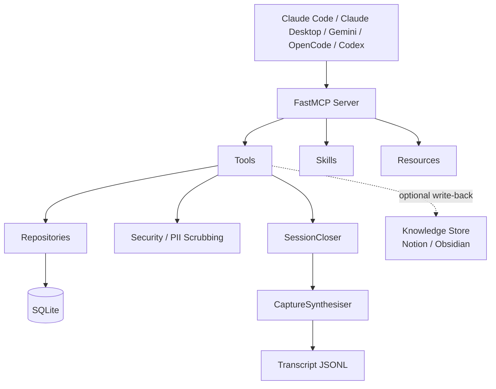

# Wizard

[](https://www.python.org/downloads/)
[](LICENSE)
[](https://github.com/jlowin/fastmcp)
[](https://www.sqlite.org/)

_A local memory layer for AI agents — persistent context across sessions,
compounding knowledge over time, and on-demand work triage._

AI coding agents forget everything between sessions. Wizard gives them
persistent memory — tasks, notes, meetings, and decisions that accumulate
and compound over time. It also tells them what to work on next, scoring
open tasks by priority, momentum, and recency across three modes: focus,
quick-wins, and unblock.

## Quick Start

**Prerequisites:** Python 3.14+, [uv](https://docs.astral.sh/uv/)

```bash
git clone https://github.com/kiran-capoor94/wizard.git
cd wizard
uv sync
uv run wizard setup --agent claude-code
```

`wizard setup` creates `~/.wizard/`, scaffolds `config.json`, installs
skills, registers the MCP server with your chosen agent, and installs
the auto-capture hook. For optional write-back to Notion or Obsidian,
run `uv run wizard configure knowledge-store` after setup.

## How It Works

Wizard is built around a **session lifecycle** that keeps your agent
grounded across work sessions.

1. **Session continuity** — `session_start` creates a session and returns
   your open and blocked tasks, unsummarised meetings, and optional
   knowledge store context. Abandoned sessions from prior runs are
   auto-closed and their transcripts synthesised.
2. **Compounding context** — Notes, decisions, and investigations accumulate
   per task across sessions. Every time you revisit a task, prior context
   surfaces automatically. The more you use Wizard, the less ramp-up each
   session costs.
3. **Transcript synthesis** — When a session ends, a `SessionEnd` hook fires
   and Wizard synthesises the agent's conversation transcript into structured
   notes (investigation, decision, docs, learnings) via `CaptureSynthesiser`.
   No manual `save_note` calls required.
4. **Work triage** — `what_should_i_work_on` scores your open tasks by
   priority, recency, and momentum in three modes: `focus` (weighted toward
   high-priority active work), `quick-wins` (simplicity-weighted), and
   `unblock` (surfaces stuck tasks). The skill handles the full interaction —
   just say "what should I work on?" or "I have 30 minutes".

## MCP Tools

Wizard exposes 17 tools via the
[Model Context Protocol](https://modelcontextprotocol.io/).
The MCP server self-describes its tools — this is just for orientation.

| Tool                     | Description                                                                    |
| ------------------------ | ------------------------------------------------------------------------------ |
| `session_start`          | Create session, return open/blocked tasks, unsummarised meetings, wizard context |
| `session_end`            | Persist session summary and state                                              |
| `resume_session`         | Restore prior session state into a new session                                 |
| `task_start`             | Get full task context + all prior notes (compounds across sessions)            |
| `create_task`            | Create a new task, optionally linked to a meeting                              |
| `update_task`            | Update any task field                                                          |
| `rewind_task`            | Full note timeline for a task, oldest to newest                                |
| `save_note`              | Scrub PII and persist investigation/decision/learning notes                    |
| `what_am_i_missing`      | 7-point diagnostic — surfaces stale context, missing decisions, etc.           |
| `what_should_i_work_on`  | Scored recommendation with mode (focus / quick-wins / unblock) and time budget |
| `get_meeting`            | Retrieve transcript and linked open tasks                                      |
| `save_meeting_summary`   | Store meeting summary and create linked note                                   |
| `ingest_meeting`         | Accept raw meeting data (e.g. from Krisp), scrub and store                     |
| `get_tasks`              | Paginated task list with optional status and source filters                    |
| `get_task`               | Full task detail with note timeline and task state                             |
| `get_sessions`           | Paginated session history                                                      |
| `get_session`            | Single session detail with state and prior notes                               |

## MCP Resources

Wizard also exposes 5 read-only resources:

| URI                                | Description                                  |
| ---------------------------------- | -------------------------------------------- |
| `wizard://session/current`         | Active session ID + open/blocked task counts |
| `wizard://tasks/open`              | All open tasks                               |
| `wizard://tasks/blocked`           | All blocked tasks                            |
| `wizard://tasks/{task_id}/context` | Task + full note timeline                    |
| `wizard://config`                  | Integration status, scrubbing, DB path       |

## Skills

Wizard ships 10 FastMCP skills, installed to `~/.wizard/skills/` during
`wizard setup`. Skills guide agent behaviour for common workflows — when
a trigger phrase is detected, the agent loads and follows the skill.

| Skill                   | When it fires                                                  |
| ----------------------- | -------------------------------------------------------------- |
| `session-start`         | Beginning a coding session                                     |
| `session-end`           | "Let's wrap up", "I'm done for today"                          |
| `session-resume`        | "Continue where I left off", "pick up from yesterday"          |
| `task-start`            | "Let's work on task X", picking a task from triage             |
| `what-should-i-work-on` | "What should I work on?", "I have 30 minutes", "quick win"     |
| `note`                  | After investigations, decisions, or non-obvious discoveries    |
| `meeting`               | Summarising a meeting flagged by session_start                 |
| `meeting-to-tasks`      | Turning meeting action items into tracked tasks                |
| `code-review`           | Reviewing code changes with prior wizard context               |
| `architecture-debate`   | Choosing between design approaches before implementing         |

## Architecture



**MCP Layer** — FastMCP server exposing tools, skills, and resources.
Tools are the write path, resources are the read path, skills guide agent
behaviour. A `ToolLoggingMiddleware` logs every tool invocation.

**Triage** — `what_should_i_work_on` scores open tasks using priority,
recency, momentum, and simplicity signals with mode-based weight vectors
(`focus`, `quick-wins`, `unblock`). Reasons are generated via LLM sampling
for the top candidates.

**Session Management** — `SessionCloser` auto-closes abandoned sessions at
`session_start`. `CaptureSynthesiser` reads the agent's JSONL transcript
and produces structured notes (investigation / decision / docs / learnings)
via LLM sampling, with a synthetic fallback if sampling fails.

**Security** — PII scrubbing on all ingested content before it touches
disk. Regex-based with an allowlist for org-specific identifiers you want
to preserve. Scrub before storage, not on read — data at rest should never
contain PII.

**Repositories** — Query layer over SQLModel/SQLite. Prior notes are
automatically retrieved when you revisit a task, producing compounding
context across sessions.

**Knowledge Store** — Optional write-back to Notion or Obsidian. Not
required for core Wizard functionality. Configure with
`wizard configure knowledge-store`.

**Why SQLite?** Local-first, zero infrastructure, ships with Python.
Wizard is a personal tool — it doesn't need Postgres.

## Configuration

After running `wizard setup`, edit `~/.wizard/config.json`:

```json
{
  "db": "~/.wizard/wizard.db",
  "scrubbing": {
    "enabled": true,
    "allowlist": ["ENG-\\d+"]
  }
}
```

That's the minimal config. Wizard works without a knowledge store.

### Knowledge Store (optional)

A knowledge store enables optional write-back — session summaries and
task updates can be pushed to Notion or Obsidian. Configure interactively:

```bash
uv run wizard configure knowledge-store
```

This prompts for the backend type (`notion` / `obsidian` / blank for none)
and the relevant credentials, then writes a `knowledge_store` block to
`config.json`:

**Notion:**

```json
"knowledge_store": {
  "type": "notion",
  "notion": {
    "daily_parent_id": "notion-page-id",
    "tasks_db_id": "notion-tasks-database-id",
    "meetings_db_id": "notion-meetings-database-id"
  }
}
```

You'll need a [Notion integration token](https://www.notion.so/profile/integrations)
with access to your task and meeting databases. The IDs here are database
page IDs (visible in the Notion URL).

**Obsidian:**

```json
"knowledge_store": {
  "type": "obsidian",
  "obsidian": {
    "vault_path": "/path/to/vault",
    "daily_notes_folder": "Daily",
    "tasks_folder": "Tasks"
  }
}
```

Override the config path with the `WIZARD_CONFIG_FILE` environment variable.

## CLI

```bash
uv run wizard setup [--agent AGENT]  # Initialize ~/.wizard/, config, skills, MCP + hook registration
uv run wizard configure --notion     # Auto-discover Notion schema
uv run wizard sync                   # Manual sync from Jira/Notion
uv run wizard doctor [--all]         # Health check — config, database, integrations, skills
uv run wizard analytics [--week]     # Session/task/note usage stats
uv run wizard update                 # Pull latest, sync deps, migrate DB, re-register agents + hooks
uv run wizard uninstall [--yes]      # Clean removal of all state, MCP, and hook registration
uv run wizard capture --close        # (Called by hooks) Mark session for transcript synthesis
```

**Supported agents for `--agent`:** `claude-code`, `claude-desktop`, `gemini`, `opencode`, `codex`, `all`

## Development

```bash
uv run pytest                  # Run tests (always use uv run — not plain python)
uv run server.py               # Run server locally
uv run alembic upgrade head    # Run migrations
```

### Project Structure

```text
server.py                    # FastMCP server entry point (stdio)
src/wizard/
  cli/
    main.py                  # Typer CLI (setup, configure, sync, doctor, analytics, update, uninstall, capture)
    doctor.py                # 10-point health checks
    analytics.py             # Session/note/task analytics
  mcp_instance.py            # FastMCP app factory + ToolLoggingMiddleware
  tools/                     # MCP tools (split by domain)
    session_tools.py         # session_start, session_end, resume_session
    task_tools.py            # task_start, save_note, update_task, create_task, rewind_task, what_am_i_missing
    meeting_tools.py         # get_meeting, save_meeting_summary, ingest_meeting
  resources.py               # 5 MCP read-only resources
  prompts.py                 # MCP prompt templates
  middleware.py              # ToolLoggingMiddleware + SessionStateMiddleware
  transcript.py              # TranscriptReader + CaptureSynthesiser (auto-capture)
  models.py                  # SQLModel entities (task, note, meeting, wizardsession, toolcall, task_state)
  schemas.py                 # Pydantic response schemas
  repositories.py            # Query layer
  services.py                # SyncService + WriteBackService + SessionCloser
  integrations.py            # JiraClient + NotionClient (Notion SDK v3.0)
  notion_discovery.py        # 3-pass Notion property auto-matching
  security.py                # PII scrubbing (regex + allowlist)
  config.py                  # Pydantic settings + JsonConfigSettingsSource
  mappers.py                 # External-to-internal data mapping
  database.py                # SQLite connection management
  deps.py                    # FastMCP Depends() provider functions
  agent_registration.py      # Register MCP + hooks in agent configs
  skills/                    # FastMCP skills (installed to ~/.wizard/skills/ on setup)
hooks/
  session-end.sh             # Claude Code SessionEnd hook script
```

## License

[MIT](LICENSE)

---

Built by [Kiran Capoor](https://github.com/kiran-capoor94) —
[Ctrl Alt Tech](https://youtube.com/@ctrlalttechwithkiran)

Built with [FastMCP](https://github.com/jlowin/fastmcp),
[SQLModel](https://sqlmodel.tiangolo.com/),
[Typer](https://typer.tiangolo.com/),
[httpx](https://www.python-httpx.org/), and
[Notion SDK](https://github.com/ramnes/notion-sdk-py).
