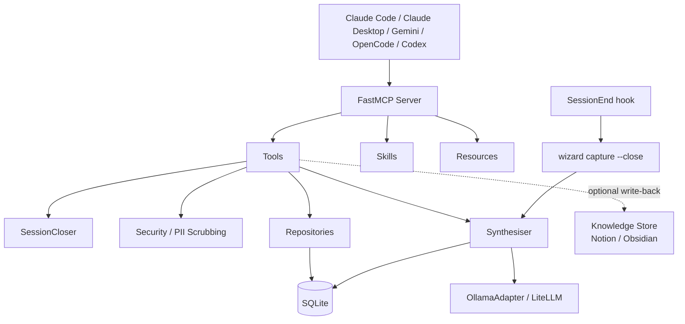

# Wizard

[](https://github.com/kiran-capoor94/wizard)
[](https://www.python.org/downloads/)
[](LICENSE)
[](https://github.com/jlowin/fastmcp)
[](https://www.sqlite.org/)

_Persistent memory for AI coding agents — context that accumulates across sessions so you never start from zero._

AI coding agents forget everything when a conversation ends. Wizard fixes that. Install it once, and your agent carries forward tasks, decisions, investigations, and meeting context — automatically, every session.

---

## Install

**Prerequisites:** Python 3.13+, [uv](https://docs.astral.sh/uv/)

```bash
uv tool install git+https://github.com/kiran-capoor94/wizard.git
wizard setup --agent claude-code
```

That's it. No server to run. No manual invocations. **You never need to interact with Wizard directly unless you want to.**

Supported agents: `claude-code`, `claude-desktop`, `gemini`, `opencode`, `codex`, `copilot`, `all`

---

## What actually happens

```
1. You start a coding session
   → Wizard loads your open tasks, blocked work, and prior context automatically

2. You work normally — no new commands to learn
   → Your agent already knows what you were working on and what decisions were made

3. When you finish, Wizard saves what happened
   → Your transcript is synthesised into structured notes (decisions, findings, learnings)

4. Next session, your context is better
   → No re-explaining, no lost decisions, no "what was I doing?"
```

The more you use it, the less ramp-up each session costs.

---

## Example

**Yesterday:** You debugged a failing API and decided to switch to Redis caching.

**Today:** You start a session. Wizard surfaces:

- your Redis caching decision
- the investigation notes from the debug session
- the related open tasks still pending

You continue instantly — no rebuilding context, no searching git history.

---

## Confirm the connection (optional)

If you're curious whether it's wired up, run:

```bash
wizard verify
```

The `wizard:` tools appear in your agent's MCP tool list. The session hook fires automatically — you don't need to do anything.

---

## Transcript synthesis (optional)

By default, Wizard stores session context — tasks, notes, and decisions — across sessions. If you enable synthesis, it also extracts structured notes from your conversation transcript using an LLM at session end.

To enable it, point Wizard at a local or cloud LLM in `~/.wizard/config.json`:

```json
"synthesis": {
  "enabled": true,
  "backends": [
    { "model": "ollama/qwen3.5:4b", "base_url": "http://localhost:11434" },
    { "model": "gemini/gemini-2.5-flash-lite", "api_key": "YOUR_KEY" }
  ]
}
```

Wizard tries backends in order — first healthy wins. Set `"enabled": false` to skip it entirely.

See [Advanced: transcript synthesis](#advanced-transcript-synthesis) for setup details, model recommendations, and backend management.

---

## Optional: Write-back to Notion or Obsidian

Wizard works without a knowledge store. If you want session summaries and tasks synced back to Notion or Obsidian:

```bash
wizard configure knowledge-store
```

---

## CLI reference

```bash
wizard setup [--agent AGENT]             # initialize, register MCP + hooks
wizard configure knowledge-store         # optional Notion/Obsidian write-back
wizard configure synthesis               # manage LLM backends
wizard doctor [--all]                    # health check
wizard analytics [--day|--week]          # session/task/note usage stats
wizard dashboard                         # launch Streamlit health dashboard (5 panels)
wizard vacuum                            # clear synthesised transcript blobs, VACUUM db
wizard update                            # upgrade install, migrate DB, re-register
wizard uninstall [--yes]                 # clean removal
wizard capture --close                   # (called by hooks) synthesise transcript
```

---

## How it works

Wizard is a local MCP server backed by SQLite. It runs as a stdio transport, registered with your agent at setup.

**Session lifecycle**

1. `SessionStart` hook fires → `session_start` creates a session, returns open and blocked tasks, prior notes, unsummarised meetings
2. You work — notes, decisions, and task state accumulate automatically via synthesis
3. `SessionEnd` hook fires → `wizard capture --close` synthesises the transcript into structured notes and closes the session

**Compounding context**

Notes accumulate per task across sessions. Every time you revisit a task, prior investigations, decisions, and learnings surface automatically. The agent doesn't need to be told what it decided last week — it's already there.

**Transcript synthesis**

Synthesis runs outside the MCP server at hook time — no round-trip cost, no dependency on the agent being active. Raw transcript content is persisted to the DB at capture time, so re-synthesis remains possible even after the agent deletes the file. The raw blob is cleared immediately after successful synthesis to keep the database compact — run `wizard vacuum` to reclaim space from older sessions. Extracted note types: `investigation`, `decision`, `docs`, `learnings`, and `failure` (failed approaches, dead ends, incorrect assumptions).

**Work triage**

`what_should_i_work_on` scores open tasks by priority, recency, and momentum in three modes: `focus` (high-priority active work), `quick-wins` (simplicity-weighted), and `unblock` (surfaces stuck tasks). Just say "what should I work on?" or "I have 30 minutes."

**Working modes**

Switch the agent's behaviour mid-session with `set_mode`. Modes are skill-backed personas stored per-session. Available out of the box: `architect` (systems design), `ideation` (divergent creative exploration), `product-owner` (user-value focus). Configure allowed modes in `~/.wizard/config.json` under `modes.allowed`. The active mode surfaces in `session_start` and `get_modes` responses.

**PII scrubbing**

All ingested content is scrubbed before it touches disk. Regex-based with an allowlist for org-specific identifiers. Configure in `~/.wizard/config.json`:

```json
"scrubbing": {
  "enabled": true,
  "allowlist": ["ENG-\\d+"]
}
```

**Session personalization**

A `SessionStart` hook refreshes `~/.claude/settings.json` in 80% of sessions with task-signal announcements, rotating spinner verbs, and a status line — keeping Claude Code contextually aware without manual prompting.

---

## MCP Tools

20 tools exposed via the [Model Context Protocol](https://modelcontextprotocol.io/). You don't call these manually — your agent uses them automatically.

| Tool                    | Description                                                                      |
| ----------------------- | -------------------------------------------------------------------------------- |
| `session_start`         | Create session, return open/blocked tasks, unsummarised meetings, active mode    |
| `session_end`           | Persist session summary and state                                                |
| `resume_session`        | Restore prior session state into a new session                                   |
| `task_start`            | Get tiered task context (rolling summary + key notes)                            |
| `create_task`           | Create a new task, optionally linked to a meeting                                |
| `update_task`           | Update any task field                                                            |
| `rewind_task`           | Full note timeline for a task, oldest to newest                                  |
| `save_note`             | Scrub PII, deduplicate by content hash, compress if >1000 chars, and persist     |
| `what_am_i_missing`     | 7-point diagnostic — surfaces stale context, missing decisions, etc.             |
| `what_should_i_work_on` | Scored recommendation with mode (focus / quick-wins / unblock) and time budget   |
| `get_modes`             | List available modes and the active mode for the current session                 |
| `set_mode`              | Activate or clear a working mode (e.g. architect, ideation, product-owner)       |
| `get_meeting`           | Retrieve transcript and linked open tasks                                        |
| `save_meeting_summary`  | Store meeting summary and create linked note                                     |
| `ingest_meeting`        | Accept raw meeting data (e.g. from Krisp), scrub and store (idempotent)          |
| `get_tasks`             | Paginated task list with optional status and source filters                      |
| `get_task`              | Full task detail with note timeline and task state                               |
| `get_sessions`          | Paginated session history                                                        |
| `get_session`           | Single session detail with state and prior notes                                 |
| `search`                | Full-text search across notes, sessions, meetings, and tasks (FTS5, BM25 ranked) |

## MCP Resources

5 read-only resources:

| URI                                | Description                                  |
| ---------------------------------- | -------------------------------------------- |
| `wizard://session/current`         | Active session ID + open/blocked task counts |
| `wizard://tasks/open`              | All open tasks                               |
| `wizard://tasks/blocked`           | All blocked tasks                            |
| `wizard://tasks/{task_id}/context` | Task + full note timeline                    |
| `wizard://config`                  | Integration status, scrubbing, DB path       |

## Skills

17 FastMCP skills installed to `~/.wizard/skills/` during setup. Skills guide agent behaviour for common workflows.

| Skill                   | When it fires                                                                                                                    |
| ----------------------- | -------------------------------------------------------------------------------------------------------------------------------- |
| `session-start`         | Beginning a coding session                                                                                                       |
| `session-end`           | "Let's wrap up", "I'm done for today"                                                                                            |
| `session-resume`        | "Continue where I left off", "pick up from yesterday"                                                                            |
| `task-start`            | "Let's work on task X", picking a task from triage                                                                               |
| `what-should-i-work-on` | "What should I work on?", "I have 30 minutes", "quick win"                                                                       |
| `note`                  | After investigations, decisions, or non-obvious discoveries                                                                      |
| `meeting`               | Summarising a meeting flagged by session_start                                                                                   |
| `meeting-to-tasks`      | Turning meeting action items into tracked tasks                                                                                  |
| `code-review`           | Reviewing code changes with prior wizard context                                                                                 |
| `architecture-debate`   | Choosing between design approaches before implementing                                                                           |
| `wizard-playground`     | Any diagram request — architecture, sequence, ERD, flow, state machine                                                           |
| `rulecheck`             | Scan codebase for guideline violations and orchestrate a fix PR                                                                  |
| `caveman`               | Switch to compressed, low-token output style                                                                                     |
| `architect`             | Activated via `set_mode` — principal-level systems thinking with sub-skills for arch review, constraints design, and diagramming |
| `ideation`              | Activated via `set_mode` — divergent creative exploration with elicitation and ranked recommendations                            |
| `product-owner`         | Activated via `set_mode` — ruthless user-value focus                                                                             |
| `socratic-mentor`       | Activated via `set_mode` — Socratic questioning to deepen understanding                                                          |

**Mode sub-skills** are loaded automatically as supporting context when a mode is active. `architect` mode ships with two: `arch-review` (structured architecture audit with blast-radius scoring) and `constraints-designer` (elicitation protocol for constraints and named invariants). They also appear in the mode's trigger table so the agent invokes them at the right moment.

---

## Architecture



**Layers:**

- **MCP Layer** — FastMCP server with tools (write path), resources (read path), and skills (agent guidance). `ToolLoggingMiddleware` logs every invocation with a Sentry span. `SessionStateMiddleware` snapshots session state and sets the Sentry user on each tool call.
- **Repositories** — Query layer over SQLModel/SQLite. `TaskRepository`, `NoteRepository`, `MeetingRepository`, `SessionRepository`, `TaskStateRepository`, `SearchRepository` (FTS5 fan-out), `AnalyticsRepository` (tool call frequency, session stats).
- **Synthesis** — Runs at hook time, outside the MCP server. `OllamaAdapter` for local Ollama backends; LiteLLM for cloud. Backends tried in priority order; first healthy wins. Extracts `investigation`, `decision`, `docs`, `learnings`, and `failure` note types from transcripts.
- **Artifact identity** — Every task, meeting, and session carries a UUID `artifact_id`. Notes anchor to a single entity. Enables synthesis deduplication and note lifecycle tracking (`active` / `superseded` / `unclassified`).
- **Security** — PII scrubbed before storage, not on read. Regex patterns with allowlist. `HeuristicNameFinder` detects names via honorifics and context triggers; `PseudonymStore` replaces them with stable fake names backed by the `pseudonym_map` table.
- **Knowledge Store** — Optional write-back to Notion or Obsidian. Not required for core functionality.

**Why SQLite?** Local-first, zero infrastructure, ships with Python. Wizard is a personal tool.

---

## Advanced: transcript synthesis

Synthesis routes through [LiteLLM](https://docs.litellm.ai/) to any compatible provider. The `model` field uses LiteLLM model string format: `"<provider>/<model>"`.

**Recommended local model:** `qwen3.5:4b` (3.4 GB at Q4, fast on Apple Silicon). Pull with:

```bash
ollama pull qwen3.5:4b
```

Avoid large-context variants (e.g. `-64k`, `-128k`) — their defaults require large KV cache allocations.

**Full config example:**

```json
"synthesis": {
  "enabled": true,
  "backends": [
    {
      "model": "ollama/qwen3.5:4b",
      "base_url": "http://localhost:11434",
      "api_key": "",
      "description": "Local Ollama (primary)"
    },
    {
      "model": "gemini/gemini-2.5-flash-lite",
      "api_key": "YOUR_GEMINI_API_KEY",
      "description": "Cloud fallback"
    }
  ]
}
```

`api_key` is required for cloud providers; leave empty for local endpoints. `base_url` is required for local servers; omit for cloud.

Manage backends interactively — no JSON editing required:

```bash
wizard configure synthesis              # list backends
wizard configure synthesis add         # add a backend (interactive)
wizard configure synthesis remove N    # remove by position
wizard configure synthesis move M N    # reorder (position 1 = highest priority)
wizard configure synthesis test [N]    # probe reachability
```

---

## Development

```bash
uv run pytest                  # run tests (always use uv run)
uv run server.py               # run MCP server locally
uv run alembic upgrade head    # run pending migrations (dev only)
```

### Project structure

```text
server.py                    # FastMCP server entry point (dev, stdio transport)
apm.yml                      # single-command agent setup (all agents, hooks, skills)
src/wizard/
  cli/
    main.py                  # Typer CLI (setup, configure, doctor, analytics, dashboard, update, uninstall)
    serve.py                 # wizard-server entry point (installed MCP binary)
    capture.py               # wizard capture — transcript synthesis trigger (called by hooks)
    configure.py             # configure knowledge-store + synthesis backends subcommands
    doctor.py                # 8-point health checks
    analytics.py             # session/note/task analytics
    dashboard.py             # Streamlit health dashboard (5 panels: session, notes, synthesis, memory, tool freq)
  mcp_instance.py            # FastMCP app factory + ToolLoggingMiddleware
  skills.py                  # skill loader (reads ~/.wizard/skills/)
  tools/                     # MCP tools (split by domain)
    session_tools.py         # session_start, session_end, resume_session
    session_helpers.py       # build_prior_summaries, find_previous_session_id, mid-session synthesis loop
    task_tools.py            # task_start, save_note, update_task, create_task
    note_tools.py            # rewind_task, what_am_i_missing
    task_fields.py           # apply_task_fields + elicitation helpers (mental model, done confirm, duplicate check)
    formatting.py            # task_contexts_to_json — session response serialisation
    mode_tools.py            # get_modes, set_mode — working mode activation
    triage_tools.py          # what_should_i_work_on
    meeting_tools.py         # get_meeting, save_meeting_summary, ingest_meeting
    query_tools.py           # get_tasks, get_task, get_sessions, get_session, search
  repositories/              # query layer (package)
    task.py                  # TaskRepository
    note.py                  # NoteRepository
    meeting.py               # MeetingRepository
    session.py               # SessionRepository
    task_state.py            # TaskStateRepository
    search.py                # SearchRepository — FTS5 fan-out across all entity types
    analytics.py             # AnalyticsRepository — tool call frequency, session/note stats
  resources.py               # 5 MCP read-only resources
  prompts.py                 # MCP prompt templates
  middleware.py              # ToolLoggingMiddleware (Sentry spans) + SessionStateMiddleware (snapshot + user tag)
  transcript.py              # TranscriptReader (JSONL parser)
  synthesis.py               # Synthesiser (ordered backend failover)
  llm_adapters.py            # OllamaAdapter, LiteLLM wrapper, probe_backend_health
  models.py                  # SQLModel entities
  schemas.py                 # Pydantic response schemas
  services.py                # SessionCloser
  security.py                # PII scrubbing (SecurityService, HeuristicNameFinder, PseudonymStore)
  config.py                  # Pydantic settings + BackendConfig
  database.py                # SQLite connection management
  deps.py                    # FastMCP Depends() providers
  exceptions.py              # ConfigurationError
  agent_registration.py      # register MCP + hooks in agent configs
  alembic/                   # DB migrations (bundled for wizard update)
  hooks/                     # hook scripts (bundled, copied to ~/.wizard/hooks/ on setup)
  skills/                    # FastMCP skills source (copied to ~/.wizard/skills/ on setup)
    architect/               # Mode skill + references/ sub-skills (arch-review, constraints-designer)
    ideation/                # Mode skill
    product-owner/           # Mode skill
    caveman/                 # Compressed output skill
    rulecheck/               # Guideline violation scanner + fix PR orchestrator
    wizard-playground/       # Mermaid diagram workbench (invocable skill, not a mode)
hooks/
  session-end.sh             # SessionEnd hook — transcript synthesis trigger
  session-start.sh           # SessionStart hook — personalization + session boot injection
```

---

## License

[MIT](LICENSE)

---

Built by [Kiran Capoor](https://github.com/kiran-capoor94) —
[Ctrl Alt Tech](https://youtube.com/@ctrlalttechwithkiran)

Built with [FastMCP](https://github.com/jlowin/fastmcp),
[SQLModel](https://sqlmodel.tiangolo.com/),
[Typer](https://typer.tiangolo.com/),
[httpx](https://www.python-httpx.org/), and
[Notion SDK](https://github.com/ramnes/notion-sdk-py).
