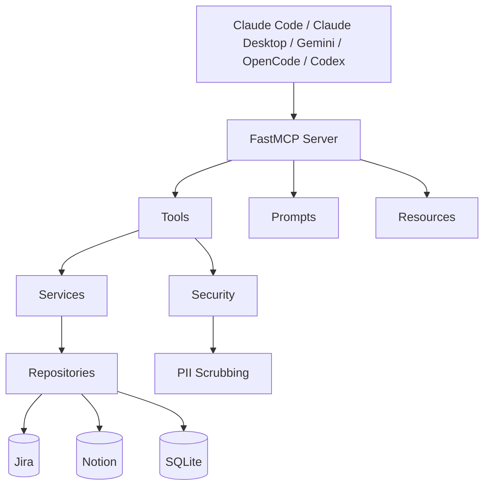

# Wizard

[](https://www.python.org/downloads/)
[](LICENSE)
[](https://github.com/jlowin/fastmcp)
[](https://www.sqlite.org/)

_A local memory layer for AI agents. Syncs Jira and Notion, scrubs PII,
and surfaces structured context across sessions._

AI coding agents forget everything between sessions. Wizard gives them
persistent memory — tasks, meetings, notes, and decisions — synced from
the tools you already use, with PII scrubbed before anything touches disk.

## Quick Start

**Prerequisites:** Python 3.14+, [uv](https://docs.astral.sh/uv/)

```bash
git clone https://github.com/kiran-capoor94/wizard.git
cd wizard
uv sync
uv run wizard setup --agent claude-code
```

`wizard setup` creates `~/.wizard/`, scaffolds `config.json`, installs
skills, registers the MCP server with your chosen agent, and installs
the auto-capture hook for automatic note generation.

See [Configuration](#configuration) for Jira and Notion setup.

## How It Works

Wizard is built around a **session lifecycle** that keeps your agent
grounded across work sessions.

1. **Session Start** — Wizard syncs tasks from Jira and meetings from
   Notion, creates a session, and returns what needs attention. Abandoned
   sessions from prior runs are auto-closed and their transcripts
   synthesised into structured notes.
2. **Work** — As you investigate tasks and review meetings, Wizard stores
   notes that compound across sessions. Each time you revisit a task, you
   get everything from before.
3. **Write-back** — Status changes and summaries push back to Jira and
   Notion so your external tools stay in sync.
4. **Session End** — Wizard persists a session summary and updates your
   daily Notion page. If the agent has a transcript, Wizard synthesises
   it into structured notes (investigation, decision, docs, learnings)
   using its own prompt scaffolding — no manual `save_note` needed.

Context compounds. The more you use Wizard, the less ramp-up time each
session costs. Your agent starts where you left off, not from scratch.

## MCP Tools

Wizard exposes 13 tools via the
[Model Context Protocol](https://modelcontextprotocol.io/).
The MCP server self-describes its tools — this is just for orientation.

| Tool                   | Description                                                           |
| ---------------------- | --------------------------------------------------------------------- |
| `session_start`        | Sync all sources, return open/blocked tasks and unsummarised meetings |
| `session_end`          | Persist session summary, update daily Notion page                     |
| `resume_session`       | Restore prior session state into a new session                        |
| `task_start`           | Get full task context + all prior notes (compounds across sessions)   |
| `create_task`          | Create a new task, optionally linked to a meeting                     |
| `update_task`          | Update any task field with optional Jira/Notion write-back            |
| `rewind_task`          | Full note timeline for a task, oldest to newest                       |
| `save_note`            | Scrub PII and persist investigation/decision/learning notes           |
| `what_am_i_missing`    | 7-point diagnostic — surfaces stale context, missing decisions, etc.  |
| `get_meeting`          | Retrieve transcript and linked open tasks                             |
| `save_meeting_summary` | Store summary, create note, update Notion                             |
| `ingest_meeting`       | Accept raw meeting data (e.g. from Krisp), scrub and store            |
| `update_task_status`   | _(Deprecated — use `update_task` instead)_                            |

## MCP Resources

Wizard also exposes 5 read-only resources:

| URI                                | Description                                  |
| ---------------------------------- | -------------------------------------------- |
| `wizard://session/current`         | Active session ID + open/blocked task counts |
| `wizard://tasks/open`              | All open tasks                               |
| `wizard://tasks/blocked`           | All blocked tasks                            |
| `wizard://tasks/{task_id}/context` | Task + full note timeline                    |
| `wizard://config`                  | Integration status, scrubbing, DB path       |

## Architecture



**MCP Layer** — FastMCP server exposing tools, prompts, and resources.
Tools are the write path, resources are the read path, prompts guide
agent behaviour. A `ToolLoggingMiddleware` logs every tool invocation.

**Services** — `SyncService` handles bidirectional upsert. External
sources win on metadata (name, priority, due date), but local wins on
status — you don't want a sync to overwrite a status you deliberately
set to BLOCKED.

**Security** — PII scrubbing on all ingested content before it touches
disk. Regex-based with an allowlist for org-specific identifiers you
want to preserve. Scrub before storage, not on read — data at rest
should never contain PII.

**Repositories** — Query layer over SQLModel/SQLite. Supports compounding
context — prior notes are automatically retrieved when you revisit a task.

**Integrations** — Jira REST API (basic auth) and Notion SDK v3.0.
Uses the `data_sources` API for all Notion database operations (query,
retrieve schema, create pages). Graceful error handling so a single
integration failure doesn't block the session.

**Why SQLite?** Local-first, zero infrastructure, ships with Python.
Wizard is a personal tool — it doesn't need Postgres.

## Configuration

After running `wizard setup`, edit `~/.wizard/config.json`:

```json
{
  "db": "~/.wizard/wizard.db",
  "jira": {
    "base_url": "https://yourorg.atlassian.net",
    "project_key": "ENG",
    "token": "your-jira-api-token",
    "email": "your@email.com"
  },
  "notion": {
    "token": "your-notion-integration-token",
    "daily_page_parent_id": "notion-page-id",
    "tasks_ds_id": "notion-tasks-data-source-id",
    "meetings_ds_id": "notion-meetings-data-source-id"
  },
  "scrubbing": {
    "enabled": true,
    "allowlist": ["ENG-\\d+"]
  }
}
```

| Field                   | Notes                                                                                                                                                 |
| ----------------------- | ----------------------------------------------------------------------------------------------------------------------------------------------------- |
| `jira.token`            | [Create an API token](https://support.atlassian.com/atlassian-account/docs/manage-api-tokens-for-your-atlassian-account/) from your Atlassian account |
| `notion.token`          | [Create an integration](https://www.notion.so/profile/integrations) and share your databases with it                                                  |
| `notion.tasks_ds_id`    | The data source ID of your Notion tasks database (not the page ID)                                                                                    |
| `notion.meetings_ds_id` | The data source ID of your Notion meetings database (not the page ID)                                                                                 |
| `scrubbing.allowlist`   | Regex patterns for identifiers to preserve through PII scrubbing (e.g. `ENG-\d+` keeps Jira keys intact)                                              |

Override the config path with the `WIZARD_CONFIG_FILE` environment variable.

### Notion Schema Discovery

Wizard can auto-detect your Notion property names:

```bash
uv run wizard configure --notion
```

This fetches your database schemas and maps property names to wizard
fields using a 3-pass matching strategy (exact name → type hint → synonyms).
Matched mappings are saved to `config.json` under `notion.notion_schema`.

### Finding Your Notion Data Source IDs

Data source IDs differ from page IDs. The easiest way to find them:

```bash
uv run wizard doctor
```

The doctor check will report schema validation results including which IDs
it resolved. Alternatively, use the Notion URL of your database — the ID
after the last `/` in the URL is the page ID; the data source ID is
surfaced by the Notion API's `data_sources` field.

## CLI

```bash
uv run wizard setup [--agent AGENT]  # Initialize ~/.wizard/, config, skills, MCP + hook registration
uv run wizard configure --notion     # Auto-discover Notion schema
uv run wizard sync                   # Manual sync from Jira/Notion
uv run wizard doctor [--all]         # Health check — config, database, integrations, skills
uv run wizard analytics [--week]     # Session/task/note usage stats
uv run wizard update                 # Pull latest, sync deps, migrate DB, re-register agents + hooks
uv run wizard uninstall [--yes]      # Clean removal of all state, MCP, and hook registration
uv run wizard capture --close        # (Called by hooks) Mark session for transcript synthesis
```

**Supported agents for `--agent`:** `claude-code`, `claude-desktop`, `gemini`, `opencode`, `codex`, `all`

## Development

```bash
uv run pytest                  # Run tests (always use uv run — not plain python)
uv run server.py               # Run server locally
uv run alembic upgrade head    # Run migrations
```

### Project Structure

```text
server.py                    # FastMCP server entry point (stdio)
src/wizard/
  cli/
    main.py                  # Typer CLI (setup, configure, sync, doctor, analytics, update, uninstall, capture)
    doctor.py                # 10-point health checks
    analytics.py             # Session/note/task analytics
  mcp_instance.py            # FastMCP app factory + ToolLoggingMiddleware
  tools/                     # MCP tools (split by domain)
    session_tools.py         # session_start, session_end, resume_session
    task_tools.py            # task_start, save_note, update_task, create_task, rewind_task, what_am_i_missing
    meeting_tools.py         # get_meeting, save_meeting_summary, ingest_meeting
  resources.py               # 5 MCP read-only resources
  prompts.py                 # MCP prompt templates
  middleware.py              # ToolLoggingMiddleware + SessionStateMiddleware
  transcript.py              # TranscriptReader + CaptureSynthesiser (auto-capture)
  models.py                  # SQLModel entities (task, note, meeting, wizardsession, toolcall, task_state)
  schemas.py                 # Pydantic response schemas
  repositories.py            # Query layer
  services.py                # SyncService + WriteBackService + SessionCloser
  integrations.py            # JiraClient + NotionClient (Notion SDK v3.0)
  notion_discovery.py        # 3-pass Notion property auto-matching
  security.py                # PII scrubbing (regex + allowlist)
  config.py                  # Pydantic settings + JsonConfigSettingsSource
  mappers.py                 # External-to-internal data mapping
  database.py                # SQLite connection management
  deps.py                    # FastMCP Depends() provider functions
  agent_registration.py      # Register MCP + hooks in agent configs
  skills/                    # FastMCP skills (installed to ~/.wizard/skills/ on setup)
hooks/
  session-end.sh             # Claude Code SessionEnd hook script
```

## License

[MIT](LICENSE)

---

Built by [Kiran Capoor](https://github.com/kiran-capoor94) —
[Ctrl Alt Tech](https://youtube.com/@ctrlalttechwithkiran)

Built with [FastMCP](https://github.com/jlowin/fastmcp),
[SQLModel](https://sqlmodel.tiangolo.com/),
[Typer](https://typer.tiangolo.com/),
[httpx](https://www.python-httpx.org/), and
[Notion SDK](https://github.com/ramnes/notion-sdk-py).
