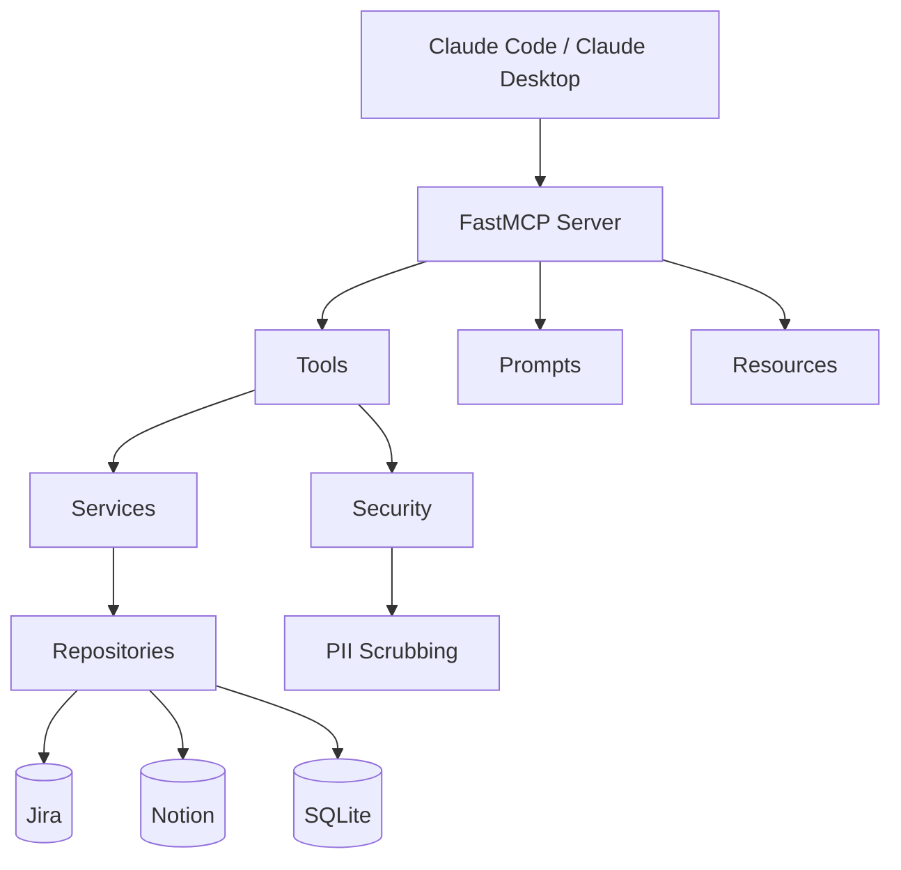

# README Implementation Plan

> **For agentic workers:** REQUIRED SUB-SKILL: Use superpowers:subagent-driven-development (recommended) or superpowers:executing-plans to implement this plan task-by-task. Steps use checkbox (`- [ ]`) syntax for tracking.

**Goal:** Populate the empty README.md with a portfolio-quality, open-source README based on the spec at `docs/superpowers/specs/2026-04-11-readme-design.md`.

**Architecture:** Single-file write (README.md) plus a LICENSE file. Content is structured in layered depth — hook, quick start, deep dive — so readers can stop at any level.

**Tech Stack:** Markdown, Mermaid (GitHub-native rendering), shields.io badges.

---

### Task 1: Create MIT LICENSE file

The repo has no LICENSE file. The README will badge and link to it, so it must exist first.

**Files:**
- Create: `LICENSE`

- [ ] **Step 1: Create the LICENSE file**

Write the MIT license text with copyright holder `Kiran Capoor` and year `2026`:

```
MIT License

Copyright (c) 2026 Kiran Capoor

Permission is hereby granted, free of charge, to any person obtaining a copy
of this software and associated documentation files (the "Software"), to deal
in the Software without restriction, including without limitation the rights
to use, copy, modify, merge, publish, distribute, sublicense, and/or sell
copies of the Software, and to permit persons to whom the Software is
furnished to do so, subject to the following conditions:

The above copyright notice and this permission notice shall be included in all
copies or substantial portions of the Software.

THE SOFTWARE IS PROVIDED "AS IS", WITHOUT WARRANTY OF ANY KIND, EXPRESS OR
IMPLIED, INCLUDING BUT NOT LIMITED TO THE WARRANTIES OF MERCHANTABILITY,
FITNESS FOR A PARTICULAR PURPOSE AND NONINFRINGEMENT. IN NO EVENT SHALL THE
AUTHORS OR COPYRIGHT HOLDERS BE LIABLE FOR ANY CLAIM, DAMAGES OR OTHER
LIABILITY, WHETHER IN AN ACTION OF CONTRACT, TORT OR OTHERWISE, ARISING FROM,
OUT OF OR IN CONNECTION WITH THE SOFTWARE OR THE USE OR OTHER DEALINGS IN THE
SOFTWARE.
```

- [ ] **Step 2: Add license field to pyproject.toml**

In `pyproject.toml`, add the `license` field after the `description` line:

```toml
license = "MIT"
```

The existing file has:
```toml
description = "Local memory layer MCP server — syncs Jira and Notion, scrubs PII, surfaces structured context across sessions"
readme = "README.md"
```

It should become:
```toml
description = "Local memory layer MCP server — syncs Jira and Notion, scrubs PII, surfaces structured context across sessions"
license = "MIT"
readme = "README.md"
```

- [ ] **Step 3: Commit**

```bash
git add LICENSE pyproject.toml
git commit -m "chore: add MIT license"
```

---

### Task 2: Write the README — Header Block (sections 1-2)

**Files:**
- Modify: `README.md`

- [ ] **Step 1: Write the header block and quick start**

Replace the entire contents of `README.md` with the header block (title, badges, tagline, problem statement) and quick start section:

```markdown
# Wizard

[](https://www.python.org/downloads/)
[](LICENSE)
[](https://github.com/jlowin/fastmcp)
[](https://www.sqlite.org/)

*A local memory layer for AI agents. Syncs Jira and Notion, scrubs PII, and surfaces structured context across sessions.*

AI coding agents forget everything between sessions. Wizard gives them persistent memory — tasks, meetings, notes, and decisions — synced from the tools you already use, with PII scrubbed before anything touches disk.

## Quick Start

**Prerequisites:** Python 3.14+, [uv](https://docs.astral.sh/uv/)

```bash
git clone https://github.com/kiran-capoor94/wizard.git
cd wizard
uv sync
wizard setup
```

`wizard setup` creates `~/.wizard/`, scaffolds `config.json`, installs skills, and registers the MCP server with Claude Code and Claude Desktop.

See [Configuration](#configuration) for Jira and Notion setup.
```

- [ ] **Step 2: Verify badges render**

Run: `cat README.md | head -10`

Verify the badge markdown is syntactically correct — each badge has `[](link-url)` format.

- [ ] **Step 3: Commit**

```bash
git add README.md
git commit -m "docs: add README header and quick start"
```

---

### Task 3: Write the README — How It Works and MCP Tools (sections 3-4)

**Files:**
- Modify: `README.md`

- [ ] **Step 1: Append the How It Works and MCP Tools sections**

Append to `README.md` after the Quick Start section:

```markdown

## How It Works

Wizard is built around a **session lifecycle** that keeps your agent grounded across work sessions.

1. **Session Start** — Wizard syncs tasks from Jira and meetings from Notion, creates a session, and returns what needs attention.
2. **Work** — As you investigate tasks and review meetings, Wizard stores notes that compound across sessions. Each time you revisit a task, you get everything from before.
3. **Write-back** — Status changes and summaries push back to Jira and Notion so your external tools stay in sync.
4. **Session End** — Wizard persists a session summary and updates your daily Notion page.

Context compounds. The more you use Wizard, the less ramp-up time each session costs. Your agent starts where you left off, not from scratch.

## MCP Tools

Wizard exposes 9 tools via the [Model Context Protocol](https://modelcontextprotocol.io/). The MCP server self-describes its tools, so this is just for orientation.

| Tool | Description |
|------|-------------|
| `session_start` | Sync all sources, return open/blocked tasks and unsummarised meetings |
| `session_end` | Persist session summary, update daily Notion page |
| `task_start` | Get full task context + all prior notes |
| `create_task` | Create a new task, optionally linked to a meeting |
| `update_task_status` | Update status locally + write back to Jira/Notion |
| `save_note` | Scrub PII and persist investigation/decision/learning notes |
| `get_meeting` | Retrieve transcript and linked open tasks |
| `save_meeting_summary` | Store summary, create note, update Notion |
| `ingest_meeting` | Accept raw meeting data (e.g. from Krisp), scrub and store |
```

- [ ] **Step 2: Verify tool list matches source**

Run: `grep -E "^def |^async def " src/wizard/tools.py`

Confirm all public tool functions (excluding `_log_tool_call`) appear in the table: `session_start`, `task_start`, `save_note`, `update_task_status`, `get_meeting`, `save_meeting_summary`, `session_end`, `ingest_meeting`, `create_task`. That's 9 tools.

- [ ] **Step 3: Commit**

```bash
git add README.md
git commit -m "docs: add how it works and MCP tools sections"
```

---

### Task 4: Write the README — Architecture (section 5)

**Files:**
- Modify: `README.md`

- [ ] **Step 1: Append the Architecture section**

Append to `README.md`:

```markdown

## Architecture



**MCP Layer** — FastMCP server exposing tools, prompts, and resources. Tools are the write path, resources are the read path, prompts guide agent behaviour.

**Services** — `SyncService` handles bidirectional upsert. External sources win on metadata (name, priority, due date), but local wins on status — you don't want a sync to overwrite a status you deliberately set to BLOCKED.

**Security** — PII scrubbing on all ingested content before it touches disk. Regex-based with an allowlist for org-specific identifiers you want to preserve. Why scrub before storage instead of on read? Data at rest should never contain PII. Defence in depth.

**Repositories** — Query layer over SQLModel/SQLite. Supports compounding context — prior notes are automatically retrieved when you revisit a task.

**Integrations** — Jira REST API (basic auth) and Notion SDK. Graceful error handling so a single integration failure doesn't block the session.

**Why SQLite?** Local-first, zero infrastructure, ships with Python. Wizard is a personal tool — it doesn't need Postgres.
```

- [ ] **Step 2: Commit**

```bash
git add README.md
git commit -m "docs: add architecture section with mermaid diagram"
```

---

### Task 5: Write the README — Configuration, CLI, Development (sections 6-8)

**Files:**
- Modify: `README.md`

- [ ] **Step 1: Append Configuration, CLI, and Development sections**

Append to `README.md`:

````markdown

## Configuration

After running `wizard setup`, edit `~/.wizard/config.json`:

```json
{
  "db": "~/.wizard/wizard.db",
  "jira": {
    "base_url": "https://yourorg.atlassian.net",
    "project_key": "ENG",
    "token": "your-jira-api-token",
    "email": "your@email.com"
  },
  "notion": {
    "token": "your-notion-integration-token",
    "sisu_work_page_id": "notion-page-id",
    "tasks_db_id": "notion-tasks-db-id",
    "meetings_db_id": "notion-meetings-db-id"
  },
  "scrubbing": {
    "enabled": true,
    "allowlist": ["ENG-\\d+"]
  }
}
```

| Field | Notes |
|-------|-------|
| `jira.token` | [Create an API token](https://support.atlassian.com/atlassian-account/docs/manage-api-tokens-for-your-atlassian-account/) from your Atlassian account |
| `notion.token` | [Create an integration](https://www.notion.so/profile/integrations) and share your databases with it |
| `scrubbing.allowlist` | Regex patterns for identifiers to preserve through PII scrubbing (e.g. `ENG-\d+` keeps Jira keys intact) |

Override the config path with the `WIZARD_CONFIG_FILE` environment variable.

## CLI

```
wizard setup       # Initialize ~/.wizard/, config, skills, MCP registration
wizard sync        # Manual sync from Jira/Notion
wizard doctor      # Health check — config, database, integrations, skills
wizard uninstall   # Clean removal of all state and MCP registration
```

## Development

```bash
uv run pytest                  # Run tests
uv run server.py               # Run server locally
uv run alembic upgrade head    # Run migrations
```

### Project Structure

```
server.py                # FastMCP server entry point
src/wizard/
  mcp_instance.py        # MCP app factory
  models.py              # SQLModel entities (Task, Meeting, Note, Session)
  schemas.py             # Pydantic response schemas
  repositories.py        # Query layer
  services.py            # Sync and write-back logic
  integrations.py        # Jira and Notion clients
  mappers.py             # External-to-internal data mapping
  tools.py               # MCP tool functions
  prompts.py             # MCP prompt templates
  resources.py           # MCP read-only resources
  security.py            # PII scrubbing
  config.py              # Pydantic settings
  database.py            # SQLite connection management
  deps.py                # Dependency injection
  mcp_config.py          # MCP server configuration
  cli/
    main.py              # Typer CLI (setup, sync, doctor, uninstall)
  skills/                # FastMCP skills (installed to ~/.wizard/skills/)
```
````

- [ ] **Step 2: Verify project structure matches actual files**

Run: `ls src/wizard/*.py src/wizard/cli/*.py server.py`

Confirm every file listed in the structure block exists and no significant `.py` files are missing.

- [ ] **Step 3: Commit**

```bash
git add README.md
git commit -m "docs: add configuration, CLI, and development sections"
```

---

### Task 6: Write the README — Footer (section 9)

**Files:**
- Modify: `README.md`

- [ ] **Step 1: Append the footer**

Append to `README.md`:

```markdown

## License

[MIT](LICENSE)

---

Built by [Kiran Capoor](https://github.com/kiran-capoor94) — [Ctrl Alt Tech](https://youtube.com/@ctrlalttechwithkiran)

Built with [FastMCP](https://github.com/jlowin/fastmcp), [SQLModel](https://sqlmodel.tiangolo.com/), [Typer](https://typer.tiangolo.com/), [httpx](https://www.python-httpx.org/), and [Notion SDK](https://github.com/ramnes/notion-sdk-py).
```

- [ ] **Step 2: Final review — read the complete README**

Run: `cat README.md`

Check for:
- All 9 sections present in order (Header, Quick Start, How It Works, MCP Tools, Architecture, Configuration, CLI, Development, Footer)
- No broken markdown (unclosed code blocks, mismatched backticks)
- Mermaid block has opening and closing triple backticks with `mermaid` language tag
- All internal links resolve (`#configuration` anchor matches the heading)
- Badge URLs are well-formed

- [ ] **Step 3: Commit**

```bash
git add README.md
git commit -m "docs: add license section and footer"
```
