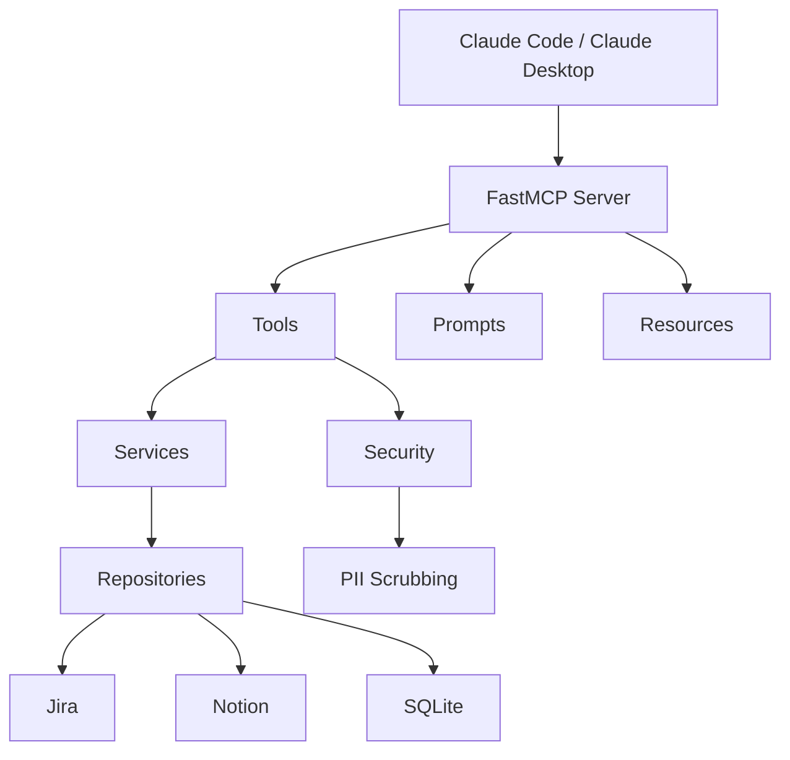

# README Design Spec

## Purpose

Populate the empty `README.md` with a portfolio-quality, open-source README that
serves two audiences: people who want to **use** Wizard, and people who want to
**understand** it (portfolio visitors, Ctrl Alt Tech viewers, senior engineers).

## Audience

- Open-source users who want to install and configure Wizard
- Portfolio/YouTube visitors who want to understand the architecture and design thinking
- Range: students to senior engineers

## Tone

Direct structure with short "why I built it this way" asides in key sections.
Technical and concise, but not dry. Matches Kiran's engineering voice.

## Approach

Narrative Hook -> Quick Start -> Deep Dive (layered depth).

The reader can stop at any level and still get value:
- Scanning? The tagline and badges tell you what this is.
- Installing? Quick Start gets you running in 4 commands.
- Evaluating? Architecture and design decisions show the thinking.

---

## Section Structure

### 1. Header Block

**Title:** `# Wizard`

**Badges (3-4 max):**
- Python 3.14+ (shields.io badge)
- License (TBD — no LICENSE file exists yet, suggest MIT)
- FastMCP (version badge or "Built with FastMCP")
- SQLite

**Tagline (italic, under title):**
> *A local memory layer for AI agents. Syncs Jira and Notion, scrubs PII, and
> surfaces structured context across sessions.*

**Problem statement (2-3 sentences):**
AI coding agents forget everything between sessions. Wizard gives them persistent
memory — tasks, meetings, notes, and decisions — synced from the tools you already
use, with PII scrubbed before anything touches disk.

### 2. Quick Start

**Prerequisites:** Python 3.14+, uv

**Commands:**
```
git clone git@github.com:kiran-capoor94/wizard.git
cd wizard
uv sync
wizard setup
```

**One-liner:** `wizard setup` creates `~/.wizard/`, scaffolds `config.json`,
installs skills, and registers the MCP server with Claude Code and Claude Desktop.

**Forward reference:** "See [Configuration](#configuration) for Jira and Notion setup."

### 3. How It Works

Narrative walkthrough of the session lifecycle in 4 steps:

1. **Session Start** — Wizard syncs tasks from Jira and meetings from Notion,
   creates a session, and returns what needs attention.
2. **Work** — As you investigate tasks and review meetings, Wizard stores notes
   that compound across sessions. Each time you revisit a task, you get everything
   from before.
3. **Write-back** — Status changes and summaries push back to Jira and Notion so
   your external tools stay in sync.
4. **Session End** — Wizard persists a session summary and updates your daily
   Notion page.

**"Why" aside:** Context compounds. The more you use Wizard, the less ramp-up time
each session costs. Your agent starts where you left off, not from scratch.

### 4. MCP Tools

Reference table — tool name + one-line description. No deep parameter docs (the
MCP server self-describes its tools).

| Tool | Description |
|------|-------------|
| `session_start` | Sync all sources, return open/blocked tasks and unsummarised meetings |
| `session_end` | Persist session summary, update daily Notion page |
| `task_start` | Get full task context + all prior notes |
| `create_task` | Create a new task, optionally linked to a meeting |
| `update_task_status` | Update status locally + write back to Jira/Notion |
| `save_note` | Scrub PII and persist investigation/decision/learning notes |
| `get_meeting` | Retrieve transcript and linked open tasks |
| `save_meeting_summary` | Store summary, create note, update Notion |
| `ingest_meeting` | Accept raw meeting data (e.g. from Krisp), scrub and store |

### 5. Architecture

**Mermaid diagram** showing the layered architecture:



**Layer descriptions (one short paragraph each):**

- **MCP Layer** — FastMCP server exposing tools, prompts, and resources. Tools are
  the write path, resources are the read path, prompts guide agent behaviour.
- **Services** — `SyncService` handles bidirectional upsert (external source wins
  on metadata like name/priority, local wins on status). `WriteBackService` pushes
  changes to Jira and Notion.
- **Security** — PII scrubbing on all ingested content before it touches disk.
  Regex-based with an allowlist for org-specific identifiers you want to preserve.
- **Repositories** — Query layer over SQLModel/SQLite. Supports compounding context
  — prior notes are automatically retrieved when you revisit a task.
- **Integrations** — Jira REST API (basic auth) and Notion SDK. Graceful error
  handling so a single integration failure doesn't block the session.

**"Why" asides:**
- **Split ownership on upsert:** You don't want a sync to overwrite a status you
  deliberately set to BLOCKED.
- **Scrub before storage, not on read:** Data at rest should never contain PII.
  Defence in depth.
- **SQLite:** Local-first, zero infrastructure, ships with Python. Wizard is a
  personal tool — it doesn't need Postgres.

### 6. Configuration

**Example `~/.wizard/config.json`:**
```json
{
  "db": "~/.wizard/wizard.db",
  "jira": {
    "base_url": "https://yourorg.atlassian.net",
    "project_key": "ENG",
    "token": "your-jira-api-token",
    "email": "your@email.com"
  },
  "notion": {
    "token": "your-notion-integration-token",
    "sisu_work_page_id": "notion-page-id",
    "tasks_db_id": "notion-tasks-db-id",
    "meetings_db_id": "notion-meetings-db-id"
  },
  "scrubbing": {
    "enabled": true,
    "allowlist": ["ENG-\\d+"]
  }
}
```

**Notes:**
- Jira token: generated from Atlassian account settings (link to Atlassian docs)
- Notion token: created via Notion integrations page (link to Notion docs)
- `allowlist`: regex patterns for identifiers you want to preserve through scrubbing
  (e.g. Jira keys like `ENG-123`)
- Override config path: set `WIZARD_CONFIG_FILE` environment variable

### 7. CLI

```
wizard setup       # Initialize ~/.wizard/, config, skills, MCP registration
wizard sync        # Manual sync from Jira/Notion
wizard doctor      # Health check — config, database, integrations, skills
wizard uninstall   # Clean removal of all state and MCP registration
```

### 8. Development

**Run tests:**
```
uv run pytest
```

**Run server locally:**
```
uv run server.py
```

**Run migrations:**
```
uv run alembic upgrade head
```

**Project structure:**
```
src/wizard/
  server.py          # FastMCP server entry point
  mcp_instance.py    # MCP app factory
  models.py          # SQLModel entities (Task, Meeting, Note, Session)
  repositories.py    # Query layer
  services.py        # Sync and write-back logic
  integrations.py    # Jira and Notion clients
  tools.py           # MCP tool functions
  prompts.py         # MCP prompt templates
  resources.py       # MCP read-only resources
  security.py        # PII scrubbing
  config.py          # Pydantic settings
  database.py        # SQLite connection management
  cli/
    main.py          # Typer CLI (setup, sync, doctor, uninstall)
```

### 9. Footer

**Built by:** Kiran Capoor — [Ctrl Alt Tech](https://youtube.com/@ctrlalttechwithkiran)

**License:** TBD (no LICENSE file exists — recommend adding MIT)

**Built with:** FastMCP, SQLModel, Typer, httpx, Notion SDK

---

## Open Decisions

- **License:** No LICENSE file exists in the repo. Recommend MIT. Needs to be
  created as a separate task before or alongside the README.
- **GitHub URL format:** Currently using SSH remote
  (`git@github-personal:kiran-capoor94/wizard.git`). The Quick Start should use
  HTTPS for public cloning: `https://github.com/kiran-capoor94/wizard.git`.
- **Badge URLs:** Will use shields.io static badges. Exact URLs to be determined
  during implementation based on whether a CI workflow badge is available.

## Out of Scope

- CONTRIBUTING.md or contributor guidelines (separate task if needed)
- Detailed API documentation beyond the tools table
- Changelog (separate task)
- Logo creation
