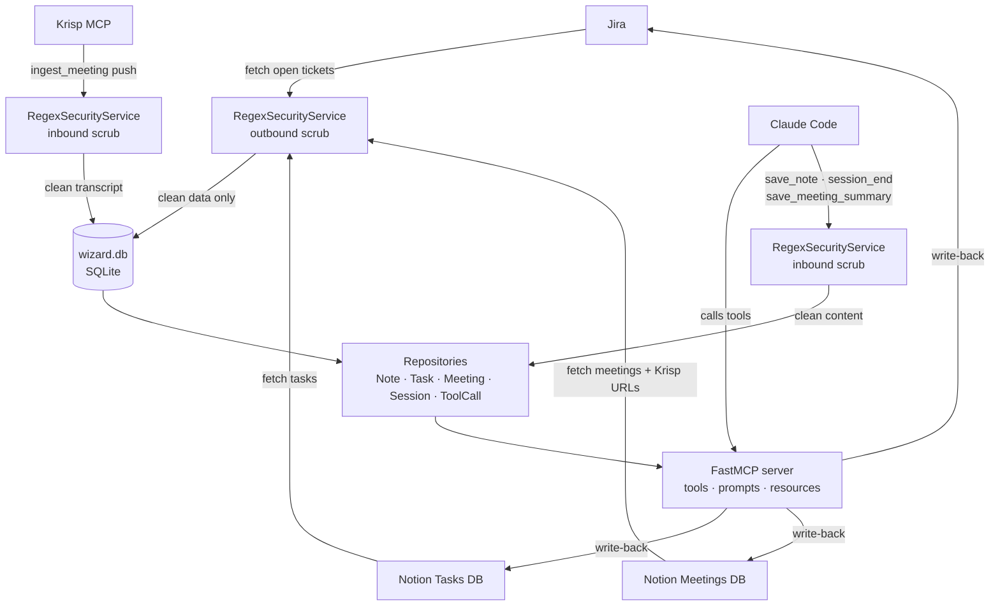
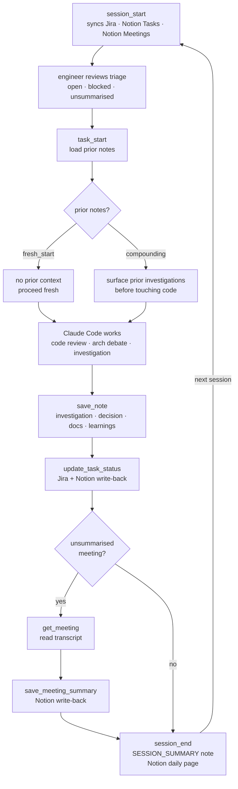
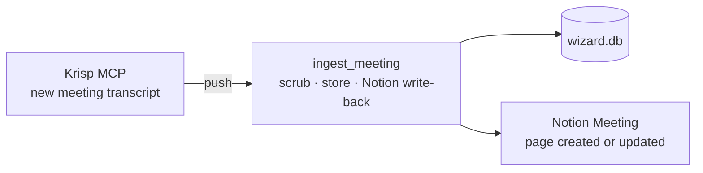
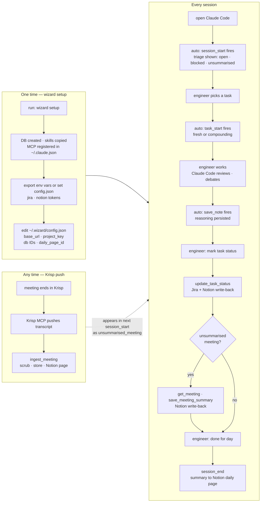
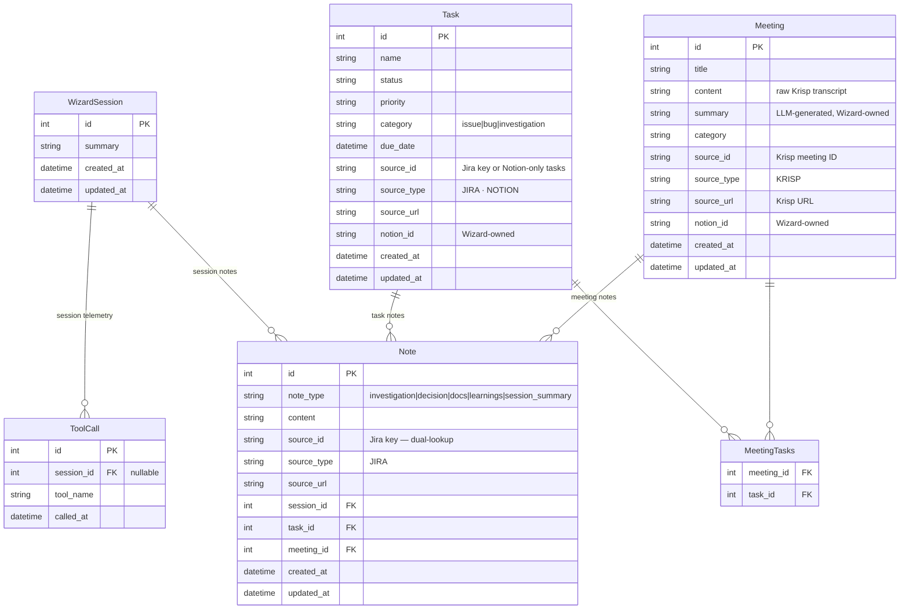

# WIZARD v1.1.1 — Implementation Spec

**Status:** Implementation Blueprint  
**Version:** 1.1.1  
**Target:** Local-first Memory Layer for AI Agents (Claude Code)

---

## 1. Core Architecture

Wizard is the Integration and Memory Layer. It syncs external data (Jira, Notion), scrubs PII, persists reasoning from Claude Code, and surfaces structured context across sessions. Claude Code is the reasoning engine. Wizard remembers.

| Layer | Component | Decision |
|-------|-----------|----------|
| Data Store | SQLite | Zero-daemon. Single file at `~/.wizard/wizard.db`. |
| ORM / Schema | SQLModel + Alembic | SQLModel for schema. Alembic for migrations. |
| Agent Interface | FastMCP | Exposes tools, prompts, and resources. Claude Code connects once and gets all three. |
| Security | RegexSecurityService | Two-way PII scrubbing. Indexed stubs (`[EMAIL_1]`). Permanent, irreversible. |
| Jira sync | JiraClient | Fetches open tickets on `session_start`. `atlassian-python-api`-based. Scrubs before storage. |
| Notion sync | NotionClient (bidirectional) | Fetches tasks and meetings FROM Notion. Writes session summaries, task status, and meeting summaries BACK to Notion. Uses `notion-client` SDK. |
| Krisp | `ingest_meeting` tool | Krisp MCP server pushes transcripts to Wizard. No polling. No KrispClient. |
| Telemetry | `ToolCall` table | Every tool invocation logged to DB. Provides behavioral baseline for measuring compounding effectiveness. |

**How Krisp works:** Krisp exposes its own MCP server. Claude Code connects to both Wizard and Krisp simultaneously. When Krisp's MCP provides a transcript, Claude Code calls Wizard's `ingest_meeting` tool to scrub and store it. Wizard does not poll Krisp.

**How Notion works:** Notion is the secondary source of truth. `SyncService` queries both the Tasks DB and the Meeting Notes DB in Notion on every `session_start`. Tasks and meetings are upserted locally. Krisp URL is stored as a property on Notion meeting pages — this is how Krisp meeting identity survives even before a full transcript is ingested.

**Why `ToolCall` and not token counts:** Token usage lives in the Anthropic API response that Claude Code receives — Wizard is downstream of that and cannot see it directly. `ToolCall` logs give the behavioral baseline: compounding ratio, tool invocation sequences per session, note accumulation rate. These are the leading indicators of whether Wizard is working. Token proxy instrumentation is v1.2.x work, after enough sessions to have a baseline to compare against.

---

## 2. Diagrams

### 2.1 Data Flow



**Three scrub points:**
- **Outbound (sync):** Jira and Notion data scrubbed inside `SyncService` before `db.add()`.
- **Inbound (Krisp push):** `ingest_meeting` scrubs title and transcript before storage.
- **Inbound (Claude Code content):** `save_note`, `save_meeting_summary`, `session_end` scrub content before storage.

All write-backs are fire-and-forget. `WriteBackStatus` captures `ok`, `error`, and `page_id`. Failures are logged. Local state is never rolled back.

---

### 2.2 Session Workflow



**Aside — Krisp ingest (out-of-band):**



`ingest_meeting` is not part of the session loop. It fires whenever Krisp's MCP surfaces a completed meeting. Claude Code calls it. Wizard stores the scrubbed transcript and writes a Notion page. The meeting then appears in the next `session_start` under `unsummarised_meetings`.

---

### 2.3 User Flow



---

### 2.4 Database Diagram



**`ToolCall` records every MCP tool invocation.** `session_id` is nullable because `ingest_meeting` and `create_task` can fire outside a session. `called_at` enables sequence analysis per session. No content is stored — just the tool name and timestamp.

**`Task.source_id` uniqueness:** `source_id` has a unique constraint. A Jira key and a Notion-only task cannot share the same source identifier. If a task has both a Jira key and a Notion page, the Jira key is `source_id` and `notion_id` holds the Notion page reference.

**`Note.source_type` guard:** `NoteRepository.get_for_task` filters the `source_id` condition to `source_type == "JIRA"` only. Prevents any future entity UUID from colliding with Jira key lookups.

---

## 3. Project Structure

```
wizard/                        # repo root
├── src/
│   └── wizard/                # installable package
│       ├── __init__.py
│       ├── config.py          # Settings via pydantic-settings + JsonConfigSettingsSource
│       ├── database.py        # Engine + get_session() context manager
│       ├── deps.py            # lru_cache singletons: clients, repos, services
│       ├── integrations.py    # JiraClient, NotionClient
│       ├── mappers.py         # StatusMapper, PriorityMapper, MeetingCategoryMapper
│       ├── mcp_instance.py    # FastMCP("wizard") singleton
│       ├── models.py          # SQLModel table definitions
│       ├── prompts.py         # MCP prompts: session_triage, task_investigation, etc.
│       ├── repositories.py    # TaskRepository, MeetingRepository, NoteRepository
│       ├── resources.py       # MCP resources: wizard://session/current, tasks/open, etc.
│       ├── schemas.py         # Pydantic response models + Notion property parsers
│       ├── security.py        # RegexSecurityService
│       ├── services.py        # SyncService, WriteBackService
│       ├── tools.py           # All MCP tool functions
│       ├── cli/
│       │   ├── __init__.py
│       │   └── main.py        # wizard setup, wizard sync, wizard doctor
│       └── skills/            # SKILL.md files — inside package for pip install safety
│           ├── session-start/
│           │   └── SKILL.md
│           ├── task-start/
│           │   └── SKILL.md
│           ├── note/
│           │   └── SKILL.md
│           ├── meeting/
│           │   └── SKILL.md
│           ├── code-review/
│           │   └── SKILL.md
│           ├── architecture-debate/
│           │   └── SKILL.md
│           └── session-end/
│               └── SKILL.md
├── tests/
│   ├── __init__.py
│   ├── test_security.py
│   ├── test_repositories.py
│   ├── test_tools.py
│   └── test_integrations.py
├── alembic.ini
├── pyproject.toml
└── README.md
```

**Why proper src layout:** `src/wizard/` is the standard Python packaging pattern. The `src/` directory is not a package — it's a namespace container. The installable package is `wizard`. This means `from wizard.config import settings` works identically during development (`pip install -e .`) and after installation. No source mapping hacks.

**Why `skills/` is inside `src/wizard/`:** `wizard setup` resolves the skills directory relative to `__file__`. After `pip install wizard`, the path must be inside the installed package. Placing `skills/` at the repo root breaks after installation — it is not included in the wheel. `src/wizard/skills/` is declared as package data in `pyproject.toml` and is always present post-install.

**Migration from current layout:** Current code lives in `src/` directly (flat). v1.1.1 moves it to `src/wizard/`. All internal imports use relative paths (`.config`, `.models`) and require zero changes. Test imports change from `from src.X` to `from wizard.X` (~5 lines).

**Module responsibilities:**
- `config.py` — `Settings` loaded from `~/.wizard/config.json`. No env vars for tokens — all in JSON config.
- `deps.py` — all singletons via `lru_cache`. Tests call `.cache_clear()` to reset.
- `mcp_instance.py` — single `FastMCP("wizard")` instance imported by tools, prompts, resources.
- `tools.py` — all tool functions registered on `mcp`. `ToolCall` logged at entry of each tool.
- `prompts.py` — all prompt functions registered on `mcp`. Prompts are behavioural guidance, not data access.
- `resources.py` — all resource URIs registered on `mcp`. Resources are read-only. No writes.

---

## 4. Data Schema

### Tables

**`WizardSession`** — one row per coding session.

| Field | Type | Notes |
|-------|------|-------|
| id | int PK | auto |
| summary | string nullable | written by `session_end` |
| created_at | datetime | indexed |
| updated_at | datetime | ORM-only |

**`Task`** — one row per Jira ticket or Notion-only task.

| Field | Type | Notes |
|-------|------|-------|
| id | int PK | auto |
| name | string | scrubbed on ingest |
| status | enum | TODO · IN_PROGRESS · BLOCKED · DONE · ARCHIVED |
| priority | enum | LOW · MEDIUM · HIGH |
| category | enum | ISSUE · BUG · INVESTIGATION |
| due_date | datetime nullable | from Notion |
| source_id | string nullable, unique, indexed | Jira key or None |
| source_type | string nullable, indexed | JIRA · NOTION |
| source_url | string nullable | |
| notion_id | string nullable, indexed | Wizard-owned. Never overwritten by sync. |
| created_at | datetime | indexed |
| updated_at | datetime | ORM-only |

**`Meeting`** — one row per meeting.

| Field | Type | Notes |
|-------|------|-------|
| id | int PK | auto |
| title | string | scrubbed on ingest |
| content | string | raw Krisp transcript, scrubbed |
| summary | string nullable | LLM-generated. Wizard-owned. Never overwritten by sync. |
| category | enum | STANDUP · PLANNING · RETRO · ONE_ON_ONE · GENERAL |
| source_id | string nullable, unique, indexed | Krisp meeting ID |
| source_type | string nullable, indexed | KRISP |
| source_url | string nullable | Krisp meeting URL |
| notion_id | string nullable, indexed | Wizard-owned. Never overwritten by sync. |
| created_at | datetime | indexed |
| updated_at | datetime | ORM-only |

**`MeetingTasks`** — join table.

| Field | Type | Notes |
|-------|------|-------|
| meeting_id | int FK → meeting.id | composite PK |
| task_id | int FK → task.id | composite PK |

**`Note`** — one row per saved reasoning unit.

| Field | Type | Notes |
|-------|------|-------|
| id | int PK | auto |
| note_type | enum, indexed | INVESTIGATION · DECISION · DOCS · LEARNINGS · SESSION_SUMMARY |
| content | string | scrubbed before storage |
| source_id | string nullable, indexed | Jira key — dual-lookup anchor |
| source_type | string nullable, indexed | JIRA — required when source_id is set |
| source_url | string nullable | |
| session_id | int nullable FK → wizardsession.id | |
| task_id | int nullable FK → task.id | |
| meeting_id | int nullable FK → meeting.id | |
| created_at | datetime | indexed |
| updated_at | datetime | ORM-only |

**`ToolCall`** — telemetry. One row per MCP tool invocation.

| Field | Type | Notes |
|-------|------|-------|
| id | int PK | auto |
| session_id | int nullable FK → wizardsession.id | null for out-of-session calls |
| tool_name | string | e.g. "session_start", "save_note" |
| called_at | datetime | indexed |

### Ownership rules

| Field | Owned by | Never overwritten by |
|-------|----------|----------------------|
| `Task.status` | Wizard (local) | Jira sync, Notion sync |
| `Task.notion_id` | Wizard | any sync |
| `Task.source_id` | External (set-once) | cannot change once set |
| `Meeting.summary` | Wizard | Notion sync |
| `Meeting.notion_id` | Wizard | any sync |

### Upsert logic

**Jira sync:** match on `source_id`. External wins on `name`, `priority`, `source_url`. `status`, `notion_id` preserved.

**Notion tasks sync:** match on `source_id` (Jira key) first, then `notion_id`. External wins on `name`, `priority`, `due_date`. IDs are set-once — existing `notion_id` or `source_id` are not overwritten.

**Notion meetings sync:** match on `source_id` (Krisp ID extracted from Krisp URL) first, then `notion_id`. External wins on `title`, `category`. `summary`, `notion_id` preserved.

**`ingest_meeting`:** match on `source_id` (Krisp meeting ID). External wins on `title`, `content`. `summary` and `notion_id` preserved if already set.

---

## 5. Configuration

Settings loaded via `pydantic-settings` with a custom `JsonConfigSettingsSource`. Config file location: `~/.wizard/config.json`, or overridden by `WIZARD_CONFIG_FILE` env var.

`db` defaults to `str(Path.home() / ".wizard" / "wizard.db")` in Python — not in JSON. JSON cannot evaluate `Path.home()`. This is the fix for the hardcoded path problem.

```
~/.wizard/config.json
{
  "jira": {
    "base_url": "https://your-org.atlassian.net",
    "project_key": "PD",
    "token": "<jira-api-token>"
  },
  "notion": {
    "token": "<notion-integration-token>",
    "daily_page_id": "<page-id>",
    "tasks_db_id": "<database-id>",
    "meetings_db_id": "<database-id>"
  },
  "scrubbing": {
    "enabled": true,
    "allowlist": ["AUTH-\\d+", "PD-\\d+", "SISU"]
  }
}
```

**Config fields:**

| Field | Purpose |
|-------|---------|
| `jira.base_url` | Atlassian instance URL |
| `jira.project_key` | JQL project filter |
| `jira.token` | Bearer token for Jira REST API v2 |
| `notion.token` | Notion integration secret |
| `notion.daily_page_id` | Page where `session_end` writes the session summary |
| `notion.tasks_db_id` | Notion database synced by `_sync_notion_tasks` |
| `notion.meetings_db_id` | Notion database synced by `_sync_notion_meetings` |
| `scrubbing.enabled` | Toggle PII scrubbing |
| `scrubbing.allowlist` | List of regex patterns never stubbed |

**No `database_url` in config.** Resolved in Python from `Path.home()`. Overridable via `WIZARD_CONFIG_FILE` to point at an alternate config which can specify a different `db` path.

---

## 6. Security

`RegexSecurityService` is constructed once at process start via `deps.security()`. Allowlist compiled to regex patterns at construction time — not reloaded per call.

**Pattern order is deliberate — NHS_ID before PHONE.** NHS numbers in `NNN NNN NNNN` format partially overlap with UK phone patterns when spaces are present. Matching NHS_ID first prevents partial consumption by the PHONE pattern.

**Patterns:**

| Name | What it matches |
|------|----------------|
| NHS_ID | 10-digit number in NNN NNN NNNN format |
| NI_NUMBER | UK National Insurance: two letters, six digits, letter A-D |
| EMAIL | RFC 5322 simplified |
| PHONE | UK phone: +44 or 0 prefix, 9-13 digits/spaces/hyphens |
| POSTCODE | UK postcodes including GIR 0AA |
| SECRET | Bearer tokens and sk- API keys |

**Same-value deduplication:** If the same PII value appears multiple times in a document, it receives the same stub every time. `[EMAIL_1]` always refers to the same address within one scrub call.

**Test patterns against real engineering content before shipping.** The allowlist in `config.json` is the safety valve for false positives on code identifiers, log lines, or metric values.

---

## 7. Tool Definitions

All tools in `src/wizard/tools.py`, registered on the `mcp` singleton. Every tool logs a `ToolCall` row at entry. All tools use `ToolError` for user-visible errors.

| Tool | Parameters | Returns | Notes |
|------|-----------|---------|-------|
| `session_start` | none | `SessionStartResponse` | Creates session, runs `SyncService.sync_all()`, returns open tasks, blocked tasks, unsummarised meetings, sync results |
| `task_start` | `task_id: int` | `TaskStartResponse` | Dual-lookup notes. Returns `compounding: bool`, `notes_by_type: dict`, `prior_notes: list` |
| `save_note` | `task_id, note_type, content` | `SaveNoteResponse` | Inbound scrub. Requires `task_id` — note is always anchored to a task |
| `update_task_status` | `task_id, new_status` | `UpdateTaskStatusResponse` | Local update + Jira write-back + Notion write-back. Both write-back results returned |
| `get_meeting` | `meeting_id: int` | `GetMeetingResponse` | Returns transcript + linked open tasks + `already_summarised` flag |
| `save_meeting_summary` | `meeting_id, session_id, summary, task_ids?` | `SaveMeetingSummaryResponse` | Inbound scrub. Persists summary, links tasks, Notion write-back |
| `session_end` | `session_id, summary` | `SessionEndResponse` | Inbound scrub. Persists session summary note, Notion daily page write-back |
| `ingest_meeting` | `title, content, source_id?, source_url?, category?` | `IngestMeetingResponse` | Called by Claude Code when Krisp MCP surfaces a transcript. Scrubs, stores, Notion write-back |
| `create_task` | `name, priority?, category?, source_id?, source_url?, meeting_id?` | `CreateTaskResponse` | Creates task locally, optional meeting link, Notion write-back returns `page_id` |

### Response schemas (key fields only)

**`SessionStartResponse`**

| Field | Type | Notes |
|-------|------|-------|
| session_id | int | hold for entire session |
| open_tasks | list[TaskContext] | TODO + IN_PROGRESS, sorted by priority then last-worked |
| blocked_tasks | list[TaskContext] | BLOCKED, sorted same |
| unsummarised_meetings | list[MeetingContext] | meetings where summary is null |
| sync_results | list[SourceSyncStatus] | per-source: `{source, ok, error?}` |

**`TaskStartResponse`**

| Field | Type | Notes |
|-------|------|-------|
| task | TaskContext | full task detail |
| compounding | bool | true if prior notes exist |
| notes_by_type | dict[str, int] | `{"investigation": 3, "decision": 1}` |
| prior_notes | list[NoteDetail] | all notes, most recent first |

**`TaskContext`** (shared across responses)

| Field | Notes |
|-------|-------|
| last_note_preview | first 300 chars of most recent note |
| last_worked_at | `created_at` of most recent note |
| last_note_type | enum value of most recent note |

**`UpdateTaskStatusResponse`**

| Field | Notes |
|-------|-------|
| jira_write_back | `WriteBackStatus {ok, error?}` |
| notion_write_back | `WriteBackStatus {ok, error?, page_id?}` |

**`WriteBackStatus`** (used across all write-back responses)

| Field | Notes |
|-------|-------|
| ok | bool |
| error | string, present on failure |
| page_id | Notion page ID, present when a page was created |

### `save_note` parameter contract

`save_note` takes `task_id` directly — no `session_id` threading. Every note is anchored to a task. `source_id` is not a parameter on this tool — it is read from the task by the repository. This eliminates the source_type enforcement problem: the repository always uses the task's own `source_id` and `source_type`, which are set correctly at sync time.

---

## 8. Prompts

Prompts are MCP prompt functions registered on `mcp`. Claude Code can invoke them to receive structured guidance. They do not call tools or access the DB — they return `Message` objects that shape Claude Code's reasoning.

| Prompt | Trigger | Purpose |
|--------|---------|---------|
| `session_triage(session_data)` | after `session_start` | Guides prioritisation: blocked tasks first, then unsummarised meetings, then open tasks by priority |
| `task_investigation(task_data)` | after `task_start` | Directs investigation: read prior notes first, build on compounding context, use Serena for code traversal, save findings as notes |
| `meeting_summarisation(meeting_data)` | after `get_meeting` | Template: key decisions, action items, open questions, relevant tasks |
| `session_wrapup()` | before `session_end` | Guides summary: what changed, what's still open, what matters next session |
| `user_elicitation()` | any time | Meta-guidance on when to ask the engineer vs proceed autonomously |

**Prompts are not tools.** They do not appear in `ToolCall` logs. They carry no PII risk — they do not accept or return content from the DB.

---

## 9. Resources

Resources are read-only MCP URIs. Claude Code can query them without triggering tool logic or telemetry. No writes, no side effects.

| URI | Returns | Notes |
|-----|---------|-------|
| `wizard://session/current` | `SessionResource` | Active session with open/blocked task counts |
| `wizard://tasks/open` | `OpenTasksResource` | All open tasks |
| `wizard://tasks/blocked` | `BlockedTasksResource` | All blocked tasks |
| `wizard://tasks/{task_id}/context` | `TaskContextResource` | Full task + all notes |
| `wizard://config` | `ConfigResource` | Enabled integrations, scrubbing state, DB path |

`ConfigResource` exposes `jira_enabled` and `notion_enabled` as booleans — derived from whether tokens are set. It does not expose token values.

---

## 10. Telemetry — ToolCall Table

**What is recorded:** every MCP tool invocation — tool name, called_at, session_id (if a session is active).

**What is not recorded:** parameters, responses, content, errors.

**Why no content:** the purpose is behavioral observation, not a replay log. Content would re-introduce PII risk and create a large table with no measurement value.

### Queries that answer the core question

**Compounding ratio** — what fraction of sessions on a task built on prior context:

```
task_start calls where prior_notes was non-empty
─────────────────────────────────────────────────
              all task_start calls
```

This requires correlating `ToolCall` rows with `Note` counts at call time. Approximated by: notes exist for that task at the time of the `task_start` call, which can be inferred from `Note.created_at < ToolCall.called_at`.

**Tool sequence per session** — ordering `ToolCall` by `called_at` within a `session_id` shows whether Claude Code follows the expected `session_start → task_start → save_note → session_end` pattern or diverges.

**Note accumulation rate** — `COUNT(notes) per task per week` shows whether the memory layer is being written to, which is a prerequisite for compounding.

**Session cadence** — `COUNT(session_start calls) per day` shows usage frequency.

### What `ToolCall` does not answer

Token consumption. That requires a proxy between Claude Code and `api.anthropic.com` that logs the `usage` field from API responses. This is v1.2.x scope, after enough sessions exist to have a behavioral baseline to correlate against.

---

## 11. Sync Service

`SyncService.sync_all()` runs three sequential syncs on every `session_start`. Each is wrapped in a try/except. Failures produce a `SourceSyncStatus(ok=False, error=...)` and do not block the other syncs or the session.

| Sync | Source | What it upserts |
|------|--------|----------------|
| `_sync_jira` Jira REST API v2 (via `atlassian-python-api`) | `Task` rows matched on `source_id` |
| `_sync_notion_tasks` | Notion Tasks DB | `Task` rows matched on Jira key then `notion_id` |
| `_sync_notion_meetings` | Notion Meetings DB | `Meeting` rows matched on Krisp ID (extracted from Krisp URL property) then `notion_id` |

`SyncService` receives `JiraClient`, `NotionClient`, and `SecurityService` at construction. `WriteBackService` is separate — it handles all writes to external systems from tool invocations.

---

## 12. Skill Definitions

Skills live in `src/wizard/skills/*/SKILL.md`. `wizard setup` copies them to `~/.wizard/skills/`. The MCP server serves them via `SkillsDirectoryProvider`. Server name is `"wizard"` so Claude Code sees them as `wizard:session-start` etc.

**Phase 3 blocker:** verify `SkillsDirectoryProvider` parameter name (`roots=` vs `root=`) against installed FastMCP version before implementing. Run `python -c "from fastmcp.server.providers.skills import SkillsDirectoryProvider; help(SkillsDirectoryProvider.__init__)"`.

| Skill | Slash command | Auto-invoke trigger |
|-------|--------------|-------------------|
| session-start | `/wizard:session-start` | start of every session |
| task-start | `/wizard:task-start` | engineer selects a task |
| note | `/wizard:note` | after investigation or decision |
| meeting | `/wizard:meeting` | unsummarised meeting in session data |
| code-review | `/wizard:code-review` | code review requested |
| architecture-debate | `/wizard:architecture-debate` | design decision requested |
| session-end | `/wizard:session-end` | end of session |

---

## 13. pyproject.toml (structure)

```toml
[project]
name = "wizard"
version = "1.1.1"
requires-python = ">=3.14"
dependencies = [
    "fastmcp[tasks]>=3.2.0",
    "sqlmodel>=0.0.38",
    "alembic>=1.18.4",
    "atlassian-python-api>=4.0.7",
    "httpx>=0.27",
    "typer>=0.12.0",
    "pydantic>=2.0.0",
    "pydantic-settings>=2.0.0",
    "notion-client>=3.0",
]

[project.scripts]
wizard = "wizard.cli.main:app"

[tool.hatch.build.targets.wheel]
packages = ["src/wizard"]
include = ["src/wizard/skills/**"]
```

`notion-client` SDK replaces direct `httpx` calls to the Notion API. `pydantic-settings` supports `JsonConfigSettingsSource`. `atlassian-python-api` provides the Jira REST API v2 client.

`packages = ["src/wizard"]` tells hatch the installable package is `wizard` inside the `src/` directory — standard src layout. `include = ["src/wizard/skills/**"]` ensures SKILL.md files are packaged into the wheel. Without this, `pip install wizard` produces a package with no skills.

---

## 14. Implementation Roadmap

### Phase 1 — Storage, Security, Config (Days 1-2)

- [x] `models.py` — all tables including `ToolCall`
- [x] `database.py` — engine, `get_session()` context manager
- [x] `config.py` — `Settings` with `JsonConfigSettingsSource`
- [x] `security.py` — `RegexSecurityService`
- [x] `alembic/versions/0001_initial.py` — all six tables
- [x] `repositories.py` — `TaskRepository`, `MeetingRepository`, `NoteRepository`

**Phase 1 done.** All six tables exist, config resolves path via `Path.home()`, scrubbing and dual-lookup guard verified.

---

### Phase 2 — Integrations and Services (Days 3-6)

- [x] `integrations.py` — `JiraClient`, `NotionClient`
- [x] `mappers.py` — all status, priority, and category maps
- [x] `services.py` — `SyncService`, `WriteBackService`
- [x] `deps.py` — all singletons

**Phase 2 done.** Sync populates DB from all three sources, write-backs fail gracefully.

---

### Phase 3 — MCP Server + Packaging (Days 7-10)

**Blocker:** verify `SkillsDirectoryProvider` parameter name before starting.

- [x] `mcp_instance.py`
- [x] `tools.py` — all nine tools, `ToolCall` logged at entry of each
- [x] `prompts.py` — all five prompts
- [x] `resources.py` — all five resource URIs
- [ ] **Migrate to proper src layout:** move `src/*.py` → `src/wizard/`, update test imports from `from src.X` to `from wizard.X`, update `alembic.ini` and any other config referencing `src`
- [ ] `src/wizard/skills/*/SKILL.md` — all seven skill files
- [ ] `src/wizard/cli/main.py` — `wizard setup`, `wizard sync`, `wizard doctor`
- [ ] `pyproject.toml` — version bump to 1.1.1, add `typer`, add `[project.scripts]`, `packages = ["src/wizard"]`, `include = ["src/wizard/skills/**"]`
- [ ] Verify `wizard setup` installs skills from inside the package, not repo root
- [ ] Verify `wizard doctor` passes all checks on a correctly configured machine

**End-to-End Proof:**

1. `session_start()` → response contains `session_id`, `open_tasks`, `blocked_tasks`, `unsummarised_meetings`, `sync_results`
2. `task_start(task_id=A)` → `compounding=False`, `prior_notes=[]`, `notes_by_type={}`
3. `save_note(task_id=A, note_type="investigation", content=<text>)` → `note_id=N`
4. `update_task_status(task_id=A, new_status="in_progress")` → `jira_write_back.ok=True/False`, `notion_write_back.ok=True/False`
5. `session_end(session_id=S, summary=<text>)` → `note_id=<int>`
6. New session: `task_start(task_id=A)` → `compounding=True`, `prior_notes` contains note N
7. `SELECT tool_name, called_at FROM toolcall WHERE session_id=S ORDER BY called_at` → sequence shows correct call order

**Compounding proved at step 6. Telemetry proved at step 7.**

**Krisp proof:**
1. `ingest_meeting(title=<t>, content=<transcript>, source_id=<krisp_id>)` → `meeting_id=M`, `notion_write_back` contains `page_id`
2. New `session_start()` → Meeting M appears in `unsummarised_meetings`
3. `get_meeting(M)` → `content` is scrubbed transcript, `already_summarised=False`
4. `save_meeting_summary(M, session_id=S, summary=<text>, task_ids=[A])` → meeting linked to task

---

## 15. Non-Goals (v1.1.x)

- Token consumption measurement — requires proxy instrumentation (v1.2.x)
- Code intelligence (AST, TreeSitter, CodeChunkEmbedding)
- Vectors or semantic search
- Reversible PII scrubbing
- Multi-user support
- Cloud sync
- `wizard:blast-radius` — deferred to v1.2.x
