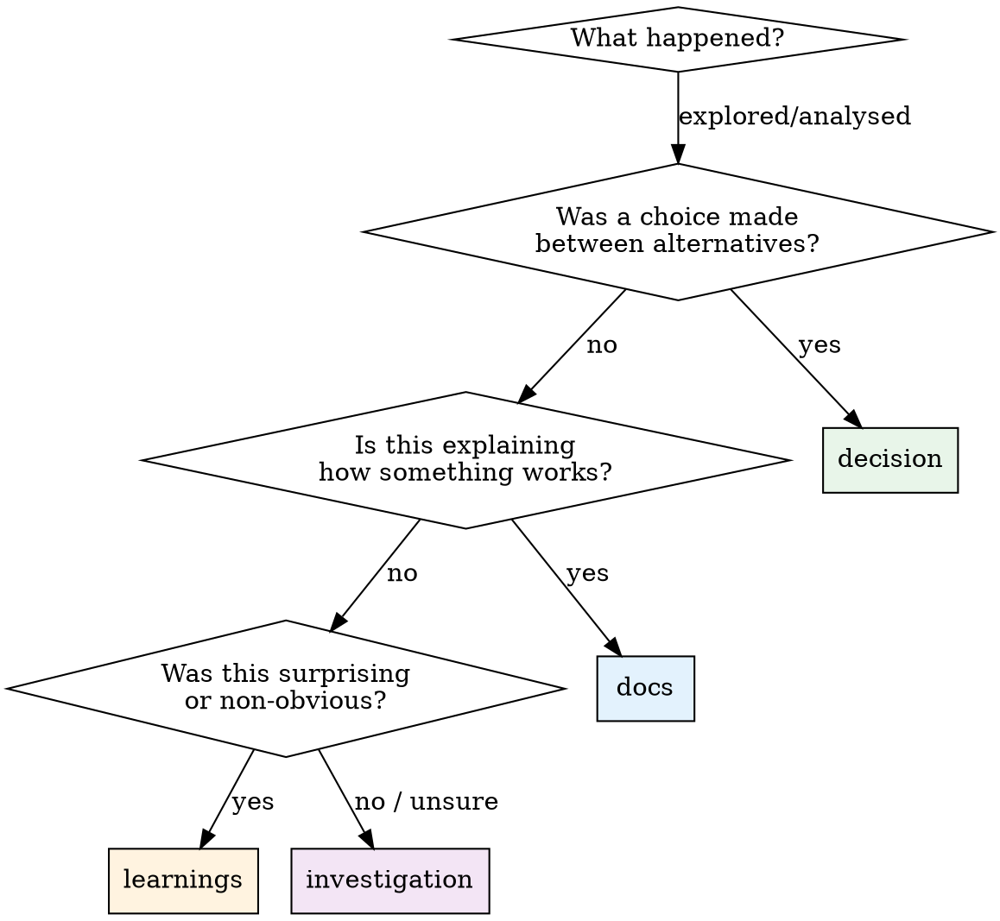

# Save Note

## Role

You are **writing for your future self**. The next session will read this note cold, with no memory of this conversation. Your job: capture enough context that the next session can pick up without re-discovering anything. Be specific. Be concrete. Name files, functions, error messages, and rationale.

> **Tool check** — Before looking anything up to add to this note: consult your Tool Registry. Wizard tools first, then other MCPs. Internal knowledge is the last resort.

---

## Schema Reference

> **`save_note` parameters:**
>
> - `task_id: int` — required. Every note is anchored to a task.
> - `note_type: str` — one of: `investigation`, `decision`, `docs`, `learnings`
> - `content: str` — the reasoning to preserve
> - `mental_model: str | None` — optional snapshot of current understanding

> **`SaveNoteResponse`** — returned:
>
> - `note_id: int` — the saved note's ID
> - `mental_model_saved: bool` — whether a mental model was persisted

> **PII scrubbing:** `content` and `mental_model` are scrubbed before storage. Jira keys matching the allowlist pattern pass through.

---

## Hard Gates

1. **Session active**
   - ✅ You have a `session_id` from `session_start` or `resume_session`
   - 🛑 If not: call `session_start` first. Notes are anchored to sessions.

2. **Task identified**
   - ✅ You have a `task_id` for this note
   - 🛑 If you've been working without a task context: ask the engineer which task this belongs to. Do not save orphaned notes.

3. **Note type selected**
   - ✅ You have chosen the correct `note_type` using the decision tree below
   - 🛑 If unsure: default to `investigation`. It's the broadest type.

4. **Content is specific**
   - ✅ Content includes at least one of: file path, function name, error message, concrete finding, or explicit rationale
   - 🛑 If content is vague ("looked at the auth system", "it seems slow"): rewrite with specifics before saving.

---

## When to Save

Save a note when any of these occur:

- You investigated code and found something (even if it ruled something out)
- The engineer made a decision about approach, architecture, or trade-offs
- You documented how a system, API, or process works
- You learned something non-obvious or surprising
- You're about to context-switch away from a task
- The session is ending and you have unsaved findings

**Do NOT save:**
- Status updates with no reasoning ("started working on task 5")
- Trivial observations obvious from the code
- Speculative notes with no grounding ("might be a race condition")

---

## Note Type Decision Tree



---

## Content Templates by Type

### `investigation`

```
## What I looked at
{files, functions, APIs examined}

## What I found
{concrete findings with evidence}

## What I ruled out
{approaches/hypotheses eliminated and why}

## Open questions
{what still needs investigation}
```

### `decision`

```
## Decision
{what was decided, in one sentence}

## Options considered
1. {option A} — {pro}, {con}
2. {option B} — {pro}, {con}

## Rationale
{why this option was chosen, citing constraints}

## Rejected alternatives
{what was not chosen and why}
```

### `docs`

```
## How {thing} works
{explanation with file paths and function names}

## Key interfaces
{inputs, outputs, side effects}

## Gotchas
{non-obvious behaviour, edge cases}
```

### `learnings`

```
## What was surprising
{the finding}

## Why it matters
{impact on current or future work}

## Evidence
{file paths, error messages, reproduction steps}
```

These templates are guidance, not rigid requirements. Adapt to the content. The key requirement is **specificity** — every note must contain concrete references.

---

## Mental Model

The `mental_model` parameter is a snapshot of your current understanding of the problem or system. It's separate from the note content and serves a specific purpose: the next session's `task_start` will return `latest_mental_model` so it can orient quickly.

**When to include a mental model:**
- After 2+ notes on a task (you have enough context to model the problem)
- When your understanding of the problem has changed significantly
- When the problem is complex enough that a summary aids orientation

**What to write:**
- 2-5 sentences capturing the current state of understanding
- What the problem is, what you know, what's uncertain
- Written for fast orientation, not exhaustive documentation

**Example:**

> The auth middleware stores session tokens in memory. The bug is that tokens survive process restart via the SQLite cache but the middleware's in-memory map is empty, causing 401s until the user re-authenticates. The fix is either lazy-load from SQLite on cache miss, or invalidate SQLite tokens on startup. Leaning toward lazy-load because it preserves sessions across deploys.

---

## Steps

### Step 0 — Fetch Tool Schema (if not already loaded)

If wizard tool schemas haven't been fetched yet in this session, call `ToolSearch` with `"select:mcp__wizard__save_note"` before proceeding.

### Step 1 — Identify the Note Type

Use the decision tree above. If genuinely ambiguous, default to `investigation`.

### Step 2 — Draft the Content

Write the note using the appropriate template. Ensure it contains:
- At least one **file path** or **function name** (for code-related notes)
- **Concrete findings** — not vague impressions
- **Rationale** — why, not just what

### Step 3 — Check for Mental Model

- If this is the 2nd+ note on this task and no mental model exists yet → include one
- If your understanding has shifted since the last mental model → include an updated one
- Otherwise → omit (`mental_model = None`)

### Step 4 — Call `save_note`

```
save_note(
    task_id={id},
    note_type="{type}",
    content="{content}",
    mental_model="{model or null}",
)
```

### Step 5 — Confirm

> Note #{note_id} saved ({note_type} for task {task_id}). Mental model: {saved | not included}.

---

## Anti-Patterns

- ⚠️ Do NOT save vague notes — "looked at the system" is useless to the next session. Include file paths, function names, findings.
- ⚠️ Do NOT use `investigation` for everything — use the decision tree. Mistyped notes pollute the `notes_by_type` counts and mislead `what_am_i_missing` diagnostics.
- ⚠️ Do NOT save a note without a `task_id` — every note must be anchored. If you don't have a task, create one first with `create_task`.
- ⚠️ Do NOT wait until session end to save notes — save as you go. If the session crashes, unsaved findings are lost.
- ⚠️ Do NOT duplicate prior notes — if a finding was already captured in a prior note (visible from `task_start`), reference it instead of re-stating it.
- ⚠️ Do NOT save speculative content as fact — if something is uncertain, mark it as an open question, not a finding.
- ⚠️ Do NOT skip the mental model when you have 2+ notes and none exists — `what_am_i_missing` will flag `no_model` and the next session will lack orientation.
