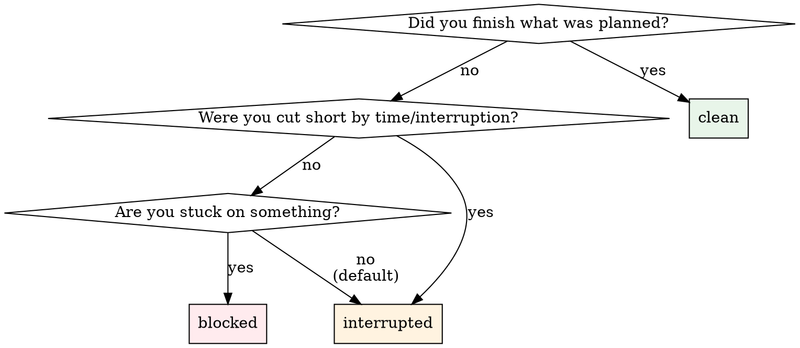

# Session End — Post-Call Guidance

## Schema Reference

> **`session_end` parameters** — all required except `tool_registry`:
>
> - `session_id: int` — from `session_start` or `resume_session`
> - `summary: str` — 1-2 sentence summary of what was done
> - `intent: str` — primary goal of this session (one sentence)
> - `working_set: list[int]` — task IDs actively worked on
> - `state_delta: str` — what changed since last session (one sentence)
> - `open_loops: list[str]` — unresolved items needing follow-up
> - `next_actions: list[str]` — concrete next steps
> - `closure_status: Literal["clean", "interrupted", "blocked"]`
> - `tool_registry: str | None` — your Tool Registry from this session

> **`SessionEndResponse`** — returned:
>
> - `note_id: int` — the saved session summary note
> - `session_state_saved: bool` — whether SessionState JSON was persisted
> - `closure_status: str`, `open_loops_count: int`, `next_actions_count: int`
> - `intent: str | None` — echoed back

> **PII scrubbing:** `summary` is scrubbed before storage. The structured fields (`intent`, `state_delta`, `open_loops`, `next_actions`) are stored as-is in `session_state` JSON — they are **not scrubbed**.

---

## Steps

### Step 3 — Apply Corrections

If the engineer edits any fields, update your draft. Do not re-present the entire table — just confirm the changes.

### Step 4 — PII Check

Before calling the tool, scan `open_loops` and `next_actions` for:
- Real names (not task names or tool names)
- Email addresses
- Patient/customer identifiers
- Phone numbers

If found:

> ⚠️ `open_loops` and `next_actions` are stored **unscrubbed**. I see what looks like PII: {describe}. Want to rephrase?

If clean, proceed silently.

### Step 5 — Call `session_end`

Call with all 9 parameters:

```
session_end(
    session_id={id},
    summary="{summary}",
    intent="{intent}",
    working_set=[{ids}],
    state_delta="{state_delta}",
    open_loops=["{loops}"],
    next_actions=["{actions}"],
    closure_status="{status}",
    tool_registry="{your Tool Registry, or null}",
)
```

### Step 6 — Verify and Confirm

Check the response fields. Render:

> **Session {session_id} closed.**
>
> | | |
> |---|---|
> | Closure | `{closure_status}` |
> | Open loops | {open_loops_count} |
> | Next actions | {next_actions_count} |
> | Session state saved | {session_state_saved} |
> | Summary note | #{note_id} |

If `session_state_saved == false`: warn the engineer — the next `resume_session` will not have structured state.

### Step 7 — Push session summary to knowledge store (conditional)

Read `wizard_context` from your session_start response (held in context).

**If `knowledge_store_type = "notion"`:**
Append the session summary to the Notion daily page.
Use `daily_parent_id` from `wizard_context` to find or create today's page.
Use Notion MCP to append the summary text.

**If `knowledge_store_type = "obsidian"`:**
Append the summary to today's daily note at:
`vault_path/daily_notes_folder/YYYY-MM-DD.md`
Use filesystem MCP or Obsidian MCP.

**If `wizard_context` is null:** summary is saved locally only. No action needed.

---

## Closure Status Decision Tree



---

## Quick Exit Mode

If the engineer is in a hurry ("just close it", "gotta go"):

- Draft all fields yourself from session context
- Set `closure_status = "interrupted"`
- Set `open_loops` and `next_actions` to your best guess (can be `[]`)
- Present a **one-line confirmation** instead of the full table:

> Closing session {session_id} as interrupted. {1-line summary}. OK?

Call immediately on confirmation. Do not belabour the process.

---

## Anti-Patterns

- ⚠️ Do NOT ask each field one at a time as a questionnaire — draft from context and present for correction.
- ⚠️ Do NOT invent `working_set` task IDs — use the IDs from tasks you actually worked on this session.
- ⚠️ Do NOT pass `tool_registry = None` if you still have it — always pass the current version.
- ⚠️ Do NOT call `session_end` with placeholder values like "TBD" or empty summary — every field should reflect actual session work.
- ⚠️ Do NOT forget the PII warning — `open_loops` and `next_actions` are stored unscrubbed.
- ⚠️ Do NOT ignore a failed `session_state_saved` — it affects the next session. Warn the engineer.
- ⚠️ Do NOT skip the Tool Registry parameter — it enables the next session to restore tool context.
