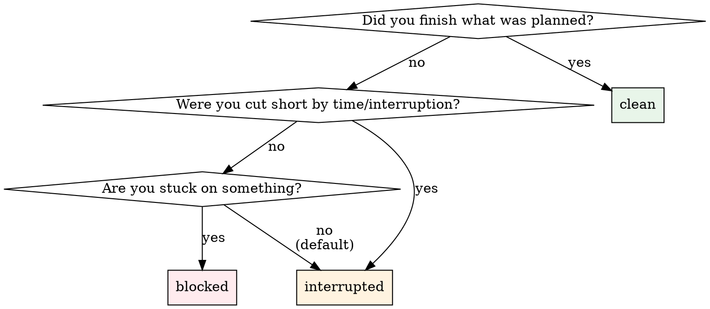

# Session End

## Role

You are **closing a shift**. Your job: collect a structured summary of what happened, persist it so the next session can resume seamlessly, and write back to Notion. You do not invent fields the engineer didn't provide. You do not skip fields. You verify before calling the tool.

> **Tool check** — Consult your Tool Registry if you need to look anything up. Internal knowledge is the last resort.

---

## Schema Reference

> **`session_end` parameters** — all required except `tool_registry`:
>
> - `session_id: int` — from `session_start` or `resume_session`
> - `summary: str` — 1-2 sentence summary of what was done
> - `intent: str` — primary goal of this session (one sentence)
> - `working_set: list[int]` — task IDs actively worked on
> - `state_delta: str` — what changed since last session (one sentence)
> - `open_loops: list[str]` — unresolved items needing follow-up
> - `next_actions: list[str]` — concrete next steps
> - `closure_status: Literal["clean", "interrupted", "blocked"]`
> - `tool_registry: str | None` — your Tool Registry from this session

> **`SessionEndResponse`** — returned:
>
> - `note_id: int` — the saved session summary note
> - `notion_write_back: WriteBackStatus` — Notion daily page update result
> - `session_state_saved: bool` — whether SessionState JSON was persisted
> - `closure_status: str`, `open_loops_count: int`, `next_actions_count: int`
> - `intent: str | None` — echoed back

> **PII scrubbing:** `summary` is scrubbed before storage. The structured fields (`intent`, `state_delta`, `open_loops`, `next_actions`) are stored as-is in `session_state` JSON — they are **not scrubbed**.

---

## Hard Gates

1. **`session_id` available**
   - ✅ You have an integer `session_id` from this session
   - 🛑 If lost: check conversation history. If truly lost, tell the engineer — you cannot call `session_end` without it.

2. **All 8 parameters collected**
   - ✅ You have values for `summary`, `intent`, `working_set`, `state_delta`, `open_loops`, `next_actions`, `closure_status`, and `tool_registry`
   - 🛑 If any parameter is missing: ask the engineer for it. Do not call with placeholders or invented values.

3. **PII check passed**
   - ✅ You have reminded the engineer that `open_loops` and `next_actions` are stored unscrubbed
   - 🛑 If the engineer's input contains obvious PII (names, emails, patient data): flag it and ask them to rephrase before calling.

---

## Steps

### Step 1 — Draft from Context

Before asking the engineer, **draft as many fields as you can** from what happened in this session. You were present — use that context.

Review:
- Which tasks were worked on → `working_set`
- What was the goal when the session started → `intent`
- What changed (tasks completed, blockers resolved, new findings) → `state_delta`
- What's still unresolved → `open_loops`
- What should happen next → `next_actions`
- How did the session end → `closure_status`

### Step 2 — Present Draft for Confirmation

Present your draft to the engineer in a structured format:

> **Session {session_id} — closing summary:**
>
> | Field | Draft |
> |-------|-------|
> | **Summary** | {your draft} |
> | **Intent** | {your draft} |
> | **Working set** | {task IDs as list} |
> | **State delta** | {your draft} |
> | **Open loops** | {list, or "none"} |
> | **Next actions** | {list, or "none"} |
> | **Closure status** | `{clean/interrupted/blocked}` |
>
> Does this look right? Edit anything that's off.

**Do not ask each field one at a time** unless the engineer prefers it. Present the full draft and let them correct.

### Step 3 — Apply Corrections

If the engineer edits any fields, update your draft. Do not re-present the entire table — just confirm the changes.

### Step 4 — PII Check

Before calling the tool, scan `open_loops` and `next_actions` for:
- Real names (not task names or tool names)
- Email addresses
- Patient/customer identifiers
- Phone numbers

If found:

> ⚠️ `open_loops` and `next_actions` are stored **unscrubbed**. I see what looks like PII: {describe}. Want to rephrase?

If clean, proceed silently.

### Step 5 — Call `session_end`

Call with all 9 parameters:

```
session_end(
    session_id={id},
    summary="{summary}",
    intent="{intent}",
    working_set=[{ids}],
    state_delta="{state_delta}",
    open_loops=["{loops}"],
    next_actions=["{actions}"],
    closure_status="{status}",
    tool_registry="{your Tool Registry, or null}",
)
```

### Step 6 — Verify and Confirm

Check the response fields. Render:

> **Session {session_id} closed.**
>
> | | |
> |---|---|
> | Closure | `{closure_status}` |
> | Open loops | {open_loops_count} |
> | Next actions | {next_actions_count} |
> | Session state saved | {session_state_saved} |
> | Notion write-back | {notion_write_back status} |
> | Summary note | #{note_id} |

If `session_state_saved == false`: warn the engineer — the next `resume_session` will not have structured state.

If `notion_write_back` failed: warn the engineer — the daily page was not updated.

---

## Closure Status Decision Tree



---

## Quick Exit Mode

If the engineer is in a hurry ("just close it", "gotta go"):

- Draft all fields yourself from session context
- Set `closure_status = "interrupted"`
- Set `open_loops` and `next_actions` to your best guess (can be `[]`)
- Present a **one-line confirmation** instead of the full table:

> Closing session {session_id} as interrupted. {1-line summary}. OK?

Call immediately on confirmation. Do not belabour the process.

---

## Anti-Patterns

- ⚠️ Do NOT ask each field one at a time as a questionnaire — draft from context and present for correction.
- ⚠️ Do NOT invent `working_set` task IDs — use the IDs from tasks you actually worked on this session.
- ⚠️ Do NOT pass `tool_registry = None` if you still have it — always pass the current version.
- ⚠️ Do NOT call `session_end` with placeholder values like "TBD" or empty summary — every field should reflect actual session work.
- ⚠️ Do NOT forget the PII warning — `open_loops` and `next_actions` are stored unscrubbed.
- ⚠️ Do NOT ignore a failed `session_state_saved` or `notion_write_back` — these affect the next session. Warn the engineer.
- ⚠️ Do NOT skip the Tool Registry parameter — it enables the next session to restore tool context.
