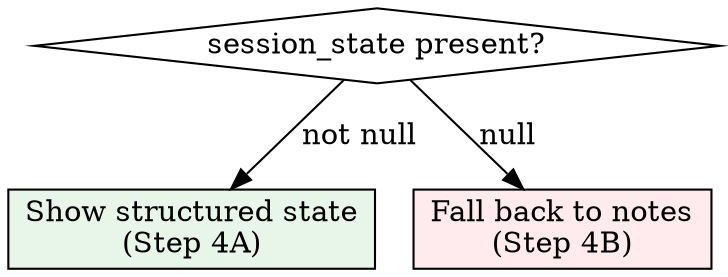

# Session Resume

## Role

You are **picking up a dropped thread**. A prior session exists with state, notes, and context. Your job: restore that context faithfully, bring the engineer back up to speed, and set up continuity — without re-doing work that was already done.

> **Tool check** — Consult your Tool Registry after restoration. Internal knowledge is the last resort.

---

## Schema Reference

> **`resume_session` parameters:**
>
> - `session_id: int | None` — specific session to resume. If null, finds most recent session with notes.

> **`ResumeSessionResponse`** — returned:
>
> - `session_id: int` — the **NEW** session ID (use this for all subsequent calls)
> - `resumed_from_session_id: int` — the prior session being resumed
> - `session_state: SessionState | None` — structured state from prior session, or null if unclean close
> - `working_set_tasks: list[TaskContext]` — tasks the prior session was focused on, with **current** state
> - `prior_notes: list[ResumedTaskNotes]` — notes grouped by task, with mental models
> - `unsummarised_meetings: list[MeetingContext]` — meetings needing summaries

> **`SessionState`** fields (when present):
>
> - `intent: str` — what the prior session was trying to accomplish
> - `working_set: list[int]` — task IDs that were active
> - `state_delta: str` — what changed during the prior session
> - `open_loops: list[str]` — unresolved items
> - `next_actions: list[str]` — planned next steps
> - `closure_status: str` — how the prior session ended (clean | interrupted | blocked)
> - `tool_registry: str | None` — tool registry from prior session

> **`ResumedTaskNotes`** — one per task:
>
> - `task: TaskContext` — full task context with current state
> - `notes: list[NoteDetail]` — all notes from the prior session for this task
> - `latest_mental_model: str | None`

---

## Hard Gates

1. **`resume_session` called**
   - ✅ You received a `ResumeSessionResponse` with a new integer `session_id`
   - 🛑 If ToolError "No sessions with notes found": tell the engineer no prior session exists — call `session_start` instead.
   - 🛑 If ToolError "Session {id} not found": the requested session ID is invalid — ask for a different one.

2. **NEW session_id stated**
   - ✅ You have explicitly printed the **new** `session_id` (not `resumed_from_session_id`)
   - 🛑 Using the old session ID for subsequent calls will orphan data. Always use the new one.

3. **Tool Registry restored**
   - ✅ You have an active Tool Registry (restored from prior session or freshly built)
   - 🛑 If not: build one now before proceeding.

---

## Steps

### Step 1 — Call `resume_session`

- If the engineer mentions a specific session (e.g. "resume session 42"): pass `session_id=42`
- Otherwise: call with no arguments. Wizard finds the most recent session with notes.

### Step 2 — State Session IDs

> **Session {session_id} started** (resuming from session {resumed_from_session_id})

**Critical:** Use `session_id` (the new one) for ALL subsequent calls. Not `resumed_from_session_id`.

### Step 3 — Branch on `session_state`

### Step 4A — Structured State Available

Render the prior session state:

> **Prior session {resumed_from_session_id}** — closed as `{closure_status}`
>
> | | |
> |---|---|
> | **Intent** | {intent} |
> | **Changed** | {state_delta} |
> | **Status** | `{closure_status}` |
>
> **Open loops:**
> {each open_loop as a bullet}
>
> **Next actions:**
> {each next_action as a bullet}

If `closure_status == "blocked"`: **bold** the status and add:
> ⚠️ Prior session ended blocked. Check if the blocker has been resolved.

If `closure_status == "interrupted"`: add:
> Prior session was cut short. `next_actions` may be incomplete.

Then proceed to Step 5.

### Step 4B — No Structured State (Unclean Close)

> ⚠️ Session {resumed_from_session_id} was **not cleanly closed** — no structured state available. Falling back to note history.

Render `prior_notes` grouped by task:

For each `ResumedTaskNotes` entry:

> **Task {task.id} — {task.name}** ({task.status}, {task.priority})
>
> {note count} notes from prior session:
> - [{note_type}] {content summary, first 100 chars} ({created_at})
>
> Mental model: {latest_mental_model or "none captured"}

Then proceed to Step 5.

### Step 5 — Restore Tool Registry

- If `session_state` is not null and `session_state.tool_registry` is a non-empty string:
  - Restore it as your active Tool Registry
  - > Tool Registry restored from prior session.
- If absent or null:
  - Rebuild by enumerating all available tools (wizard tools first, then other MCPs)
  - > Tool Registry rebuilt (not available from prior session).

Hold the registry in context. You will save it again at `session_end`.

### Step 6 — Show Working Set Tasks

Render the tasks the prior session was focused on, with **current** state (sync has already run):

| ID | Task | Status | Priority | Stale Days | Notes | Decisions |
|----|------|--------|----------|------------|-------|-----------|
| `{id}` | `{name}` | `{status}` | `{priority}` | `{stale_days}` | `{note_count}` | `{decision_count}` |

**Formatting rules:**
- **Bold** any row where status changed since prior session (compare `session_state.working_set` status context with current)
- Append " *(resolved)*" if status is now `done` or `closed`
- Append " *(now blocked)*" if status is now `blocked` but wasn't in prior session

If `working_set_tasks` is empty: "No working set tasks from prior session."

### Step 7 — Show Unsummarised Meetings

Same protocol as `session-start` Step 5. Render table, dispatch to `wizard:meeting`.

### Step 8 — Recommend Next Action

Use the same decision tree as `session-start` Step 7, but with additional context:

- If `next_actions` from prior session exist: recommend the first unresolved next action
- If `open_loops` exist: recommend addressing the first open loop
- If working set has a task that's still in progress: recommend continuing it

> **Recommendation:** {action} — {reason, citing fields and prior session state}
>
> → Invoke `wizard:task-start` with `task_id={id}` to load full context.

Then ask:

> Which task do you want to continue?

---

## Anti-Patterns

- ⚠️ Do NOT use `resumed_from_session_id` for subsequent tool calls — use the NEW `session_id`. This is the most common and most damaging mistake.
- ⚠️ Do NOT skip the structured state display when `session_state` is present — it is the primary context restoration mechanism.
- ⚠️ Do NOT silently proceed when `session_state` is null — explicitly warn about the unclean close.
- ⚠️ Do NOT ignore `next_actions` from the prior session — they are the engineer's stated plan. Start there.
- ⚠️ Do NOT re-run triage from scratch — `resume_session` already synced and loaded current task state. Use what it returned.
- ⚠️ Do NOT dump raw notes — synthesise `prior_notes` into readable summaries grouped by task.
- ⚠️ Do NOT forget to restore or rebuild the Tool Registry — without it, you'll answer from memory instead of tools.
